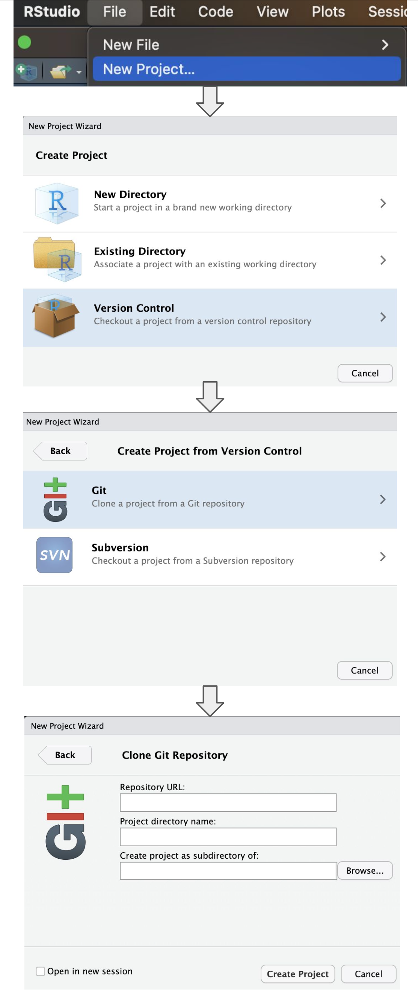

## Background

Multiple imputation is a powerful tool in presence of missing data.
However, especially in combination with propensity score analyses,
multiple imputation can lead to challenges since analytic workflows can
be become much more complex.

## Objective

This repository showcases and evaluation different multiple imputation
&gt; propensity score &gt; outcome analyses and associated
implementation challenges.

## Dependencies

This is a quarto book project and R package dependencies are managed
through the `renv` package. All packages and their versions can be
viewed in the lockfile `renv.lock`. All required packages and the
appropriate versions can be installed by running the following command:

    renv::restore(repos = "https://packagemanager.posit.co/cran/2024-04-25")

The dependencies are managed through Posit’s repository package manager
(RSPM). If you use a different operating system than macOS, please head
over to the RSPM setup website and follow these steps to adjust the URL
above.

1.  Go to the [RSPM setup
    website](https://packagemanager.posit.co/client/#/repos/cran/setup?distribution=redhat-9)

2.  Choose the operating system (if Linux, also choose the Linux
    distribution)

3.  Go to **`Repository URL:`** and copy-paste the URL to the options
    statement in the `.Rprofile` file

    *options(repos = c(REPO\_NAME = “URL”))*

## Reproducibility

Follow these steps in RStudio to reproduce this study:

1.  Clone this repository via `git clone <url>` or in RStudio via **File
    &gt; New Project &gt; Version Control &gt; Git &gt; then paste the
    link to repository URL**
2.  Install all necessary dependencies (see above)
3.  Add/adapt the paths to the datasets in `.Renviron`
4.  In RStudio, run all scripts via `quarto render` or
    `Build > Render Book` (make sure quarto is installed)

<figure>

<figcaption aria-hidden="true">Steps to clone this repository in
RStudio</figcaption>
</figure>

The data used in this project is strictly simulated and no real
patient-level data is used.

## Repository structure and files

### Directory overview

    ## .
    ## ├── 01_syvcox_coxph.qmd
    ## ├── README.md
    ## ├── RStudio_init.png
    ## ├── _book
    ## │   ├── 01_syvcox_coxph.html
    ## │   ├── RStudio_init.png
    ## │   ├── index.html
    ## │   ├── search.json
    ## │   └── site_libs
    ## ├── _quarto.yml
    ## ├── imputation-ps-workflows.Rproj
    ## ├── index.qmd
    ## ├── match_re_weight.R
    ## ├── renv
    ## │   ├── activate.R
    ## │   ├── library
    ## │   ├── settings.json
    ## │   └── staging
    ## ├── renv.lock
    ## └── update_README.R
