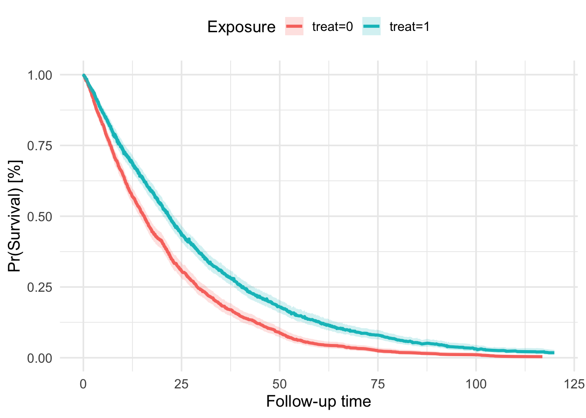

# Pooled Kaplan-Meier Estimates {#sec-pooled-km-estimates}

In this vignette, we demonstrate how to use the `km_pooling()` function from the `encore.analytics` package to compute and visualize pooled Kaplan-Meier estimates across multiply imputed and propensity score matched/weighted datasets.

## Overview

The `km_pooling()` function addresses a common challenge in survival analysis with missing data: how to properly combine Kaplan-Meier estimates across multiple imputed datasets after propensity score matching or weighting. The function implements the methodology recommended by @marshall2009 for pooling survival probabilities using Rubin's rules.

## Key Features

The function provides three main outputs:

1.  Pooled median survival estimates with confidence intervals
2.  A detailed survival probability table with pooled estimates
3.  A visualization of the pooled Kaplan-Meier curve

## Methodology

The function follows these key steps:

1.  Fits Kaplan-Meier survival functions to each imputed and matched/weighted dataset
2.  Transforms survival probabilities using complementary log-log transformation
3.  Pools transformed survival probabilities and computes total variance using Rubin's rule
4.  Back-transforms pooled survival probabilities and computes 95% confidence intervals
5.  Extracts median survival time and corresponding 95% confidence intervals
6.  Plots the Kaplan-Meier curve with pooled survival probabilities and confidence intervals

## Mathematical Details

The pooling process involves several mathematical transformations to ensure proper combination of survival estimates across imputed datasets:

### 1. Complementary Log-Log Transformation

For each time point $t$ and imputed dataset $m$, the survival probability $S_m(t)$ is transformed using the complementary log-log transformation:

$$g_m(t) = \log(-\log(1-S_m(t)))$$

This transformation helps approximate normality, which is required for proper application of Rubin's rules.

### 2. Pooling Transformed Estimates

The pooled estimate $\bar{Q}$ (following Rubin's notation) at each time point is computed as:

$$\bar{Q} = \frac{1}{M}\sum_{m=1}^M g_m(t)$$

where $M$ is the number of imputed datasets.

### 3. Variance Estimation

The total variance $T$ of the pooled estimate combines within-imputation variance $\bar{U}$ and between-imputation variance $B$:

$$\bar{U} = \frac{1}{M}\sum_{m=1}^M U_m$$

$$B = \frac{1}{M-1}\sum_{m=1}^M (g_m(t) - \bar{Q})^2$$

$$T = \bar{U} + (1 + \frac{1}{M})B$$

where $U_m$ is the variance of $g_m(t)$ in the $m$th imputed dataset.

### 4. Back-Transformation

The pooled survival probability and its confidence intervals are obtained by back-transforming:

$$S(t) = 1 - \exp(-\exp(\bar{Q}))$$

The 95% confidence intervals are computed as:

$$S_{lower}(t) = 1 - \exp(-\exp(\bar{Q} - 1.96\sqrt{T}))$$ $$S_{upper}(t) = 1 - \exp(-\exp(\bar{Q} + 1.96\sqrt{T}))$$

## Example Application

Let's walk through a complete example using simulated data:

::: {.cell}

```{.r .cell-code}
library(here)
library(dplyr)
library(survival)
library(mice)
```

::: {.cell-output .cell-output-stderr}

```
Warning: package 'mice' was built under R version 4.4.1
```


:::

```{.r .cell-code}
library(MatchThem)
library(encore.analytics)

source(here("functions", "covariate_vectors.R"))
```
:::

### Data Generation

First, we'll simulate a dataset with some missing values:


::: {.cell}

```{.r .cell-code}
# load example dataset with missing observations
data_miss <- simulate_data(
  n_total = 3500, 
  seed = 42, 
  include_id = FALSE, 
  imposeNA = TRUE,
  propNA = .33
  )
```
:::


### Multiple Imputation

We'll create 10 imputed datasets:


::: {.cell}

```{.r .cell-code}
# impute data
data_imp <- futuremice(
  parallelseed = 42,
  n.core = parallel::detectCores()-1,
  data = data_miss,
  method = "rf",
  m = 10,
  print = FALSE
  )
```
:::


### Propensity Score Weighting

We'll apply propensity score matching to each imputed dataset:


::: {.cell}

```{.r .cell-code}
# apply propensity score matching on mids object
ps_form <- as.formula(paste("treat ~", paste(covariates_for_ps, collapse = " + ")))
ps_form
```

::: {.cell-output .cell-output-stdout}

```
treat ~ dem_age_index_cont + dem_sex_cont + c_smoking_history + 
    c_number_met_sites + c_hemoglobin_g_dl_cont + c_urea_nitrogen_mg_dl_cont + 
    c_platelets_10_9_l_cont + c_calcium_mg_dl_cont + c_glucose_mg_dl_cont + 
    c_lymphocyte_leukocyte_ratio_cont + c_alp_u_l_cont + c_protein_g_l_cont + 
    c_alt_u_l_cont + c_albumin_g_l_cont + c_bilirubin_mg_dl_cont + 
    c_chloride_mmol_l_cont + c_monocytes_10_9_l_cont + c_eosinophils_leukocytes_ratio_cont + 
    c_ldh_u_l_cont + c_hr_cont + c_sbp_cont + c_oxygen_cont + 
    c_ecog_cont + c_neutrophil_lymphocyte_ratio_cont + c_bmi_cont + 
    c_ast_alt_ratio_cont + c_stage_initial_dx_cont + dem_race + 
    dem_region + dem_ses + c_time_dx_to_index
```


:::
:::


::: {.cell}

```{.r .cell-code}
# matching
mimids_data <- matchthem(
  formula = ps_form,
  datasets = data_imp,
  approach = 'within',
  method = 'nearest',
  distance = "glm",
  link = "logit",
  caliper = 0.01,
  ratio = 1,
  replace = F
  )

# print summary for matched dataset #1
mimids_data
```

::: {.cell-output .cell-output-stdout}

```
A `matchit` object
 - method: 1:1 nearest neighbor matching without replacement
 - distance: Propensity score [caliper]

             - estimated with logistic regression
 - caliper: <distance> (0.001)
 - number of obs.: 3500 (original), 2678 (matched)
 - target estimand: ATT
 - covariates: dem_age_index_cont, dem_sex_cont, c_smoking_history, c_number_met_sites, c_hemoglobin_g_dl_cont, c_urea_nitrogen_mg_dl_cont, c_platelets_10_9_l_cont, c_calcium_mg_dl_cont, c_glucose_mg_dl_cont, c_lymphocyte_leukocyte_ratio_cont, c_alp_u_l_cont, c_protein_g_l_cont, c_alt_u_l_cont, c_albumin_g_l_cont, c_bilirubin_mg_dl_cont, c_chloride_mmol_l_cont, c_monocytes_10_9_l_cont, c_eosinophils_leukocytes_ratio_cont, c_ldh_u_l_cont, c_hr_cont, c_sbp_cont, c_oxygen_cont, c_ecog_cont, c_neutrophil_lymphocyte_ratio_cont, c_bmi_cont, c_ast_alt_ratio_cont, c_stage_initial_dx_cont, dem_race, dem_region, dem_ses, c_time_dx_to_index
```


:::
:::


### Computing Pooled Kaplan-Meier Estimates

Now we can use `km_pooling()` to compute and visualize the pooled survival curves:

::: {.cell}

```{.r .cell-code}
# specify the survival model
km_fit <- as.formula(Surv(fu_itt_months, death_itt) ~ treat)

# estimate and pool median survival times and Kaplan-Meier curve
km_out <- km_pooling(
  x = mimids_data,
  surv_formula = km_fit
  )

# View median survival time estimates
km_out$km_median_survival
```

::: {.cell-output .cell-output-stdout}

```
# A tibble: 2 × 4
  strata  t_median t_lower t_upper
  <fct>      <dbl>   <dbl>   <dbl>
1 treat=0     15.5    14.3    16.5
2 treat=1     21.8    20.5    23.1
```


:::

```{.r .cell-code}
# Plot the Kaplan-Meier curve
km_out$km_plot
```

::: {.cell-output-display}
{width=672}
:::
:::

## Interpretation

The output provides:

1.  **Median Survival Times (`km_median_survival`):** Pooled median survival estimates and 95% confidence intervals for each treatment group.

-   strata = stratum
-   t_median = median survival time
-   t_lower = lower 95% CI of median survival time
-   t_upper = upper 95% CI of median survival time

2.  **Kaplan-Meier survival table (`km_survival_table`):**

-   strata = stratum

-   time = observed time point

-   m = number of imputed datasets

-   qbar = pooled univariate estimate of the complementary log-log transformed survival probabilities, see formula (3.1.2) Rubin (1987)

-   t = total variance of the pooled univariate estimate of the complementary log-log transformed survival probabilities, formula (3.1.5) Rubin (1987)

-   se = total standard error of the pooled estimate (derived as sqrt(t))

-   surv = back-transformed pooled survival probability

-   lower = Wald-type lower 95% confidence interval of back-transformed pooled survival probability

-   upper = Wald-type upper 95% confidence interval of back-transformed pooled survival probability

3.  **Kaplan-Meier Curve (**`km_plot`**)**: A visualization showing the pooled survival probabilities over time with confidence bands (ggplot2 object)

## Technical Details

The function handles several nuances in survival analysis:

-   Transforms survival probabilities to approximate normality using complementary log-log transformation
-   Applies Rubin's rules for pooling estimates and computing variance
-   Handles edge cases in median survival time estimation
-   Incorporates weights and cluster membership for matched/weighted datasets

## References
