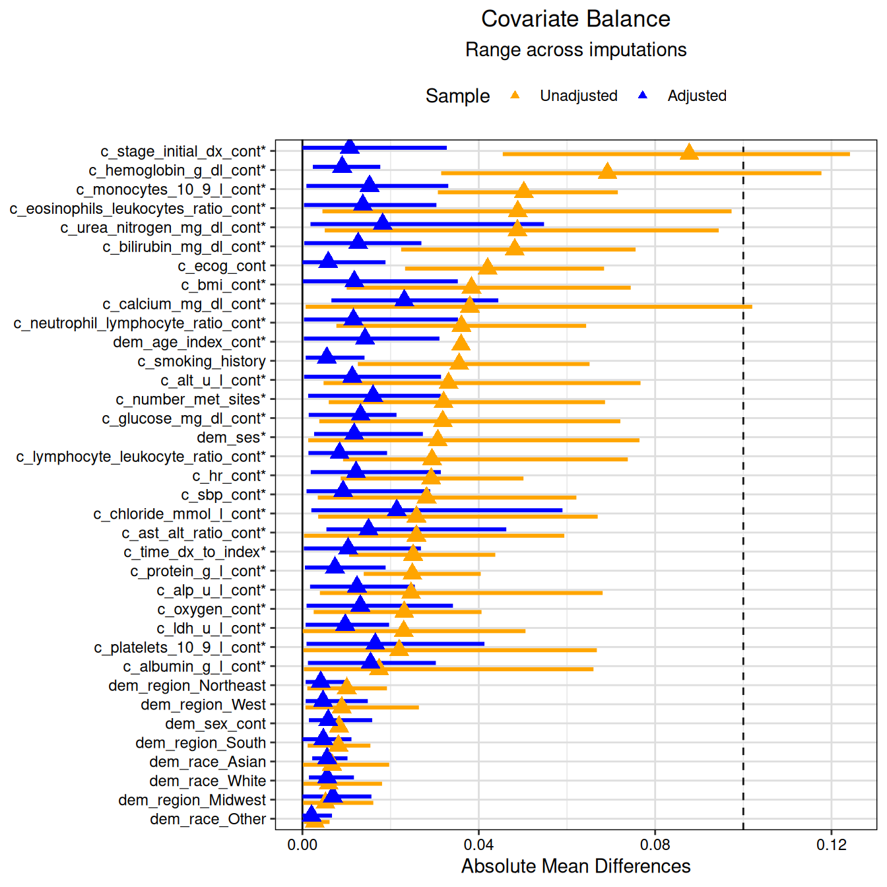
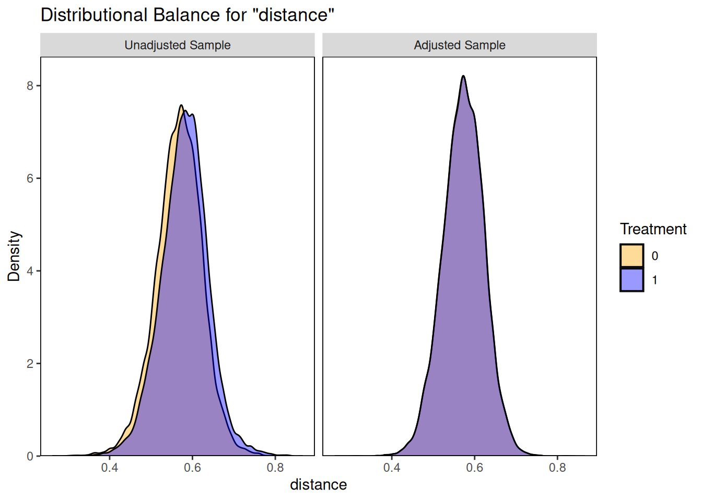

# General Workflow and application in Survival Models {#sec-application-in-cox-ph-models}

In @sec-application-in-cox-ph-models we illustrate a reproducible example on how to use `coxph` ([survival](https://cran.r-project.org/web/packages/survival/index.html) package [@survival]) and `svycoxph` ([survey](https://cran.r-project.org/web/packages/survey/index.html) package [@survey]) in combination with multiple imputation by chained equations ([mice](https://cran.r-project.org/web/packages/mice/index.html) package [@mice]) and propensity score matching using the `MatchThem` package [@pishgar2021].

First, we load the required R libraries/packages and some custom functions that are part of the `encore.io` R package that is being developed to streamline the analysis of all **ENCORE** trial emulations (non-public package).

::: {.cell warnings='false'}

```{.r .cell-code}
library(dplyr)
library(survival)
library(mice)
```

::: {.cell-output .cell-output-stderr}

```
Warning: package 'mice' was built under R version 4.5.2
```


:::

```{.r .cell-code}
library(MatchThem)
library(survey)
library(here)
library(gtsummary)
```

::: {.cell-output .cell-output-stderr}

```
Warning: package 'gtsummary' was built under R version 4.5.2
```


:::

```{.r .cell-code}
library(parallelly)
```

::: {.cell-output .cell-output-stderr}

```
Warning: package 'parallelly' was built under R version 4.5.2
```


:::

```{.r .cell-code}
library(ranger)
library(furrr)
```

::: {.cell-output .cell-output-stderr}

```
Warning: package 'future' was built under R version 4.5.2
```


:::

```{.r .cell-code}
library(cobalt)
library(gsDesign)
```

::: {.cell-output .cell-output-stderr}

```
Warning: package 'gsDesign' was built under R version 4.5.2
```


:::

```{.r .cell-code}
library(encore.analytics)
library(yaml)
```

::: {.cell-output .cell-output-stderr}

```
Warning: package 'yaml' was built under R version 4.5.2
```


:::

```{.r .cell-code}
library(gt)
```

::: {.cell-output .cell-output-stderr}

```
Warning: package 'gt' was built under R version 4.5.2
```


:::

```{.r .cell-code}
library(ggplot2)
```

::: {.cell-output .cell-output-stderr}

```
Warning: package 'ggplot2' was built under R version 4.5.2
```


:::

```{.r .cell-code}
source(here("functions", "covariate_vectors.R"))

# track time
runtime <- tictoc::tic()
```
:::

## Data generation

We use the `simulate_flaura()` function to simulate a realistic oncology comparative effectiveness analytic cohort dataset with similar distributions to [*FLAURA*](https://www.nejm.org/doi/full/10.1056/NEJMoa1913662), a randomized controlled trial that evaluated the efficacy and safety of osimertinib to standard-of-care (SoC) tyrosine kinase inhibitors (TKIs) in advanced NSCLC patients with a sensitizing EGFR mutation.

The following cohort resembles [distributions observed in the EHR-derived *EDB1*](https://drugepi.gitlab-pages.partners.org/encore/flaura-nct-02296125/00_derive_cohort_edb1.html#table-1-post-eligibility-criteria) dataset used in ENCORE. *Note: the values of some continuous covariates (labs) are displayed after log/log-log transformation.*


::: {.cell}

```{.r .cell-code}
# load example dataset with missing observations
data_miss <- simulate_data(
  n_total = 3500, 
  seed = 42, 
  include_id = FALSE, 
  imposeNA = TRUE,
  propNA = .33
  )
```
:::


We can use the `create_table1()` function from the `encore.analytics` package to create a summary table of the simulated dataset. The function is a convenient wrapper around the `gtsummary` package [@gtsummary] and allows to create a table in the following fashion:


::: {#tbl-data .cell tbl-cap='Summary table of the simulated dataset.'}

```{.r .cell-code}
# read YAML file
design_data <- read_yaml(here("_params.yml"))

# combine to a table
params <- bind_rows(design_data$params)

# named list
covariates <- params |> 
  dplyr::filter(dimension == "Covariate Assessment Window")

covariate_list <- as.list(setNames(covariates$label, covariates$variable))

data_miss |> 
  create_table1(
    covariates = names(covariate_list),
    covariates_labels = covariate_list
    )
```

::: {.cell-output-display}

```{=html}
<div id="pineguugde" style="padding-left:0px;padding-right:0px;padding-top:10px;padding-bottom:10px;overflow-x:auto;overflow-y:auto;width:auto;height:auto;">
<style>#pineguugde table {
  font-family: system-ui, 'Segoe UI', Roboto, Helvetica, Arial, sans-serif, 'Apple Color Emoji', 'Segoe UI Emoji', 'Segoe UI Symbol', 'Noto Color Emoji';
  -webkit-font-smoothing: antialiased;
  -moz-osx-font-smoothing: grayscale;
}

#pineguugde thead, #pineguugde tbody, #pineguugde tfoot, #pineguugde tr, #pineguugde td, #pineguugde th {
  border-style: none;
}

#pineguugde p {
  margin: 0;
  padding: 0;
}

#pineguugde .gt_table {
  display: table;
  border-collapse: collapse;
  line-height: normal;
  margin-left: auto;
  margin-right: auto;
  color: #333333;
  font-size: 16px;
  font-weight: normal;
  font-style: normal;
  background-color: #FFFFFF;
  width: auto;
  border-top-style: solid;
  border-top-width: 2px;
  border-top-color: #A8A8A8;
  border-right-style: none;
  border-right-width: 2px;
  border-right-color: #D3D3D3;
  border-bottom-style: solid;
  border-bottom-width: 2px;
  border-bottom-color: #A8A8A8;
  border-left-style: none;
  border-left-width: 2px;
  border-left-color: #D3D3D3;
}

#pineguugde .gt_caption {
  padding-top: 4px;
  padding-bottom: 4px;
}

#pineguugde .gt_title {
  color: #333333;
  font-size: 125%;
  font-weight: initial;
  padding-top: 4px;
  padding-bottom: 4px;
  padding-left: 5px;
  padding-right: 5px;
  border-bottom-color: #FFFFFF;
  border-bottom-width: 0;
}

#pineguugde .gt_subtitle {
  color: #333333;
  font-size: 85%;
  font-weight: initial;
  padding-top: 3px;
  padding-bottom: 5px;
  padding-left: 5px;
  padding-right: 5px;
  border-top-color: #FFFFFF;
  border-top-width: 0;
}

#pineguugde .gt_heading {
  background-color: #FFFFFF;
  text-align: center;
  border-bottom-color: #FFFFFF;
  border-left-style: none;
  border-left-width: 1px;
  border-left-color: #D3D3D3;
  border-right-style: none;
  border-right-width: 1px;
  border-right-color: #D3D3D3;
}

#pineguugde .gt_bottom_border {
  border-bottom-style: solid;
  border-bottom-width: 2px;
  border-bottom-color: #D3D3D3;
}

#pineguugde .gt_col_headings {
  border-top-style: solid;
  border-top-width: 2px;
  border-top-color: #D3D3D3;
  border-bottom-style: solid;
  border-bottom-width: 2px;
  border-bottom-color: #D3D3D3;
  border-left-style: none;
  border-left-width: 1px;
  border-left-color: #D3D3D3;
  border-right-style: none;
  border-right-width: 1px;
  border-right-color: #D3D3D3;
}

#pineguugde .gt_col_heading {
  color: #333333;
  background-color: #FFFFFF;
  font-size: 100%;
  font-weight: normal;
  text-transform: inherit;
  border-left-style: none;
  border-left-width: 1px;
  border-left-color: #D3D3D3;
  border-right-style: none;
  border-right-width: 1px;
  border-right-color: #D3D3D3;
  vertical-align: bottom;
  padding-top: 5px;
  padding-bottom: 6px;
  padding-left: 5px;
  padding-right: 5px;
  overflow-x: hidden;
}

#pineguugde .gt_column_spanner_outer {
  color: #333333;
  background-color: #FFFFFF;
  font-size: 100%;
  font-weight: normal;
  text-transform: inherit;
  padding-top: 0;
  padding-bottom: 0;
  padding-left: 4px;
  padding-right: 4px;
}

#pineguugde .gt_column_spanner_outer:first-child {
  padding-left: 0;
}

#pineguugde .gt_column_spanner_outer:last-child {
  padding-right: 0;
}

#pineguugde .gt_column_spanner {
  border-bottom-style: solid;
  border-bottom-width: 2px;
  border-bottom-color: #D3D3D3;
  vertical-align: bottom;
  padding-top: 5px;
  padding-bottom: 5px;
  overflow-x: hidden;
  display: inline-block;
  width: 100%;
}

#pineguugde .gt_spanner_row {
  border-bottom-style: hidden;
}

#pineguugde .gt_group_heading {
  padding-top: 8px;
  padding-bottom: 8px;
  padding-left: 5px;
  padding-right: 5px;
  color: #333333;
  background-color: #FFFFFF;
  font-size: 100%;
  font-weight: initial;
  text-transform: inherit;
  border-top-style: solid;
  border-top-width: 2px;
  border-top-color: #D3D3D3;
  border-bottom-style: solid;
  border-bottom-width: 2px;
  border-bottom-color: #D3D3D3;
  border-left-style: none;
  border-left-width: 1px;
  border-left-color: #D3D3D3;
  border-right-style: none;
  border-right-width: 1px;
  border-right-color: #D3D3D3;
  vertical-align: middle;
  text-align: left;
}

#pineguugde .gt_empty_group_heading {
  padding: 0.5px;
  color: #333333;
  background-color: #FFFFFF;
  font-size: 100%;
  font-weight: initial;
  border-top-style: solid;
  border-top-width: 2px;
  border-top-color: #D3D3D3;
  border-bottom-style: solid;
  border-bottom-width: 2px;
  border-bottom-color: #D3D3D3;
  vertical-align: middle;
}

#pineguugde .gt_from_md > :first-child {
  margin-top: 0;
}

#pineguugde .gt_from_md > :last-child {
  margin-bottom: 0;
}

#pineguugde .gt_row {
  padding-top: 8px;
  padding-bottom: 8px;
  padding-left: 5px;
  padding-right: 5px;
  margin: 10px;
  border-top-style: solid;
  border-top-width: 1px;
  border-top-color: #D3D3D3;
  border-left-style: none;
  border-left-width: 1px;
  border-left-color: #D3D3D3;
  border-right-style: none;
  border-right-width: 1px;
  border-right-color: #D3D3D3;
  vertical-align: middle;
  overflow-x: hidden;
}

#pineguugde .gt_stub {
  color: #333333;
  background-color: #FFFFFF;
  font-size: 100%;
  font-weight: initial;
  text-transform: inherit;
  border-right-style: solid;
  border-right-width: 2px;
  border-right-color: #D3D3D3;
  padding-left: 5px;
  padding-right: 5px;
}

#pineguugde .gt_stub_row_group {
  color: #333333;
  background-color: #FFFFFF;
  font-size: 100%;
  font-weight: initial;
  text-transform: inherit;
  border-right-style: solid;
  border-right-width: 2px;
  border-right-color: #D3D3D3;
  padding-left: 5px;
  padding-right: 5px;
  vertical-align: top;
}

#pineguugde .gt_row_group_first td {
  border-top-width: 2px;
}

#pineguugde .gt_row_group_first th {
  border-top-width: 2px;
}

#pineguugde .gt_summary_row {
  color: #333333;
  background-color: #FFFFFF;
  text-transform: inherit;
  padding-top: 8px;
  padding-bottom: 8px;
  padding-left: 5px;
  padding-right: 5px;
}

#pineguugde .gt_first_summary_row {
  border-top-style: solid;
  border-top-color: #D3D3D3;
}

#pineguugde .gt_first_summary_row.thick {
  border-top-width: 2px;
}

#pineguugde .gt_last_summary_row {
  padding-top: 8px;
  padding-bottom: 8px;
  padding-left: 5px;
  padding-right: 5px;
  border-bottom-style: solid;
  border-bottom-width: 2px;
  border-bottom-color: #D3D3D3;
}

#pineguugde .gt_grand_summary_row {
  color: #333333;
  background-color: #FFFFFF;
  text-transform: inherit;
  padding-top: 8px;
  padding-bottom: 8px;
  padding-left: 5px;
  padding-right: 5px;
}

#pineguugde .gt_first_grand_summary_row {
  padding-top: 8px;
  padding-bottom: 8px;
  padding-left: 5px;
  padding-right: 5px;
  border-top-style: double;
  border-top-width: 6px;
  border-top-color: #D3D3D3;
}

#pineguugde .gt_last_grand_summary_row_top {
  padding-top: 8px;
  padding-bottom: 8px;
  padding-left: 5px;
  padding-right: 5px;
  border-bottom-style: double;
  border-bottom-width: 6px;
  border-bottom-color: #D3D3D3;
}

#pineguugde .gt_striped {
  background-color: rgba(128, 128, 128, 0.05);
}

#pineguugde .gt_table_body {
  border-top-style: solid;
  border-top-width: 2px;
  border-top-color: #D3D3D3;
  border-bottom-style: solid;
  border-bottom-width: 2px;
  border-bottom-color: #D3D3D3;
}

#pineguugde .gt_footnotes {
  color: #333333;
  background-color: #FFFFFF;
  border-bottom-style: none;
  border-bottom-width: 2px;
  border-bottom-color: #D3D3D3;
  border-left-style: none;
  border-left-width: 2px;
  border-left-color: #D3D3D3;
  border-right-style: none;
  border-right-width: 2px;
  border-right-color: #D3D3D3;
}

#pineguugde .gt_footnote {
  margin: 0px;
  font-size: 90%;
  padding-top: 4px;
  padding-bottom: 4px;
  padding-left: 5px;
  padding-right: 5px;
}

#pineguugde .gt_sourcenotes {
  color: #333333;
  background-color: #FFFFFF;
  border-bottom-style: none;
  border-bottom-width: 2px;
  border-bottom-color: #D3D3D3;
  border-left-style: none;
  border-left-width: 2px;
  border-left-color: #D3D3D3;
  border-right-style: none;
  border-right-width: 2px;
  border-right-color: #D3D3D3;
}

#pineguugde .gt_sourcenote {
  font-size: 90%;
  padding-top: 4px;
  padding-bottom: 4px;
  padding-left: 5px;
  padding-right: 5px;
}

#pineguugde .gt_left {
  text-align: left;
}

#pineguugde .gt_center {
  text-align: center;
}

#pineguugde .gt_right {
  text-align: right;
  font-variant-numeric: tabular-nums;
}

#pineguugde .gt_font_normal {
  font-weight: normal;
}

#pineguugde .gt_font_bold {
  font-weight: bold;
}

#pineguugde .gt_font_italic {
  font-style: italic;
}

#pineguugde .gt_super {
  font-size: 65%;
}

#pineguugde .gt_footnote_marks {
  font-size: 75%;
  vertical-align: 0.4em;
  position: initial;
}

#pineguugde .gt_asterisk {
  font-size: 100%;
  vertical-align: 0;
}

#pineguugde .gt_indent_1 {
  text-indent: 5px;
}

#pineguugde .gt_indent_2 {
  text-indent: 10px;
}

#pineguugde .gt_indent_3 {
  text-indent: 15px;
}

#pineguugde .gt_indent_4 {
  text-indent: 20px;
}

#pineguugde .gt_indent_5 {
  text-indent: 25px;
}

#pineguugde .katex-display {
  display: inline-flex !important;
  margin-bottom: 0.75em !important;
}

#pineguugde div.Reactable > div.rt-table > div.rt-thead > div.rt-tr.rt-tr-group-header > div.rt-th-group:after {
  height: 0px !important;
}
</style>
<table class="gt_table" data-quarto-disable-processing="false" data-quarto-bootstrap="false">
  <thead>
    <tr class="gt_col_headings gt_spanner_row">
      <th class="gt_col_heading gt_columns_bottom_border gt_left" rowspan="2" colspan="1" scope="col" id="label"><span data-qmd-base64="KipQYXRpZW50IGNoYXJhY3RlcmlzdGljKio="><span class='gt_from_md'><strong>Patient characteristic</strong></span></span></th>
      <th class="gt_col_heading gt_columns_bottom_border gt_center" rowspan="2" colspan="1" scope="col" id="stat_0"><span data-qmd-base64="KipUb3RhbCoqIDxicj4gTiA9IDM1MDA="><span class='gt_from_md'><strong>Total</strong> <br> N = 3500</span></span><span class="gt_footnote_marks" style="white-space:nowrap;font-style:italic;font-weight:normal;line-height:0;"><sup>1</sup></span></th>
      <th class="gt_center gt_columns_top_border gt_column_spanner_outer" rowspan="1" colspan="2" scope="colgroup" id="level 1; stat_1">
        <div class="gt_column_spanner"><span data-qmd-base64="KipUcmVhdG1lbnQgcmVjZWl2ZWQqKg=="><span class='gt_from_md'><strong>Treatment received</strong></span></span></div>
      </th>
      <th class="gt_col_heading gt_columns_bottom_border gt_center" rowspan="2" colspan="1" scope="col" id="estimate"><span data-qmd-base64="KipEaWZmZXJlbmNlKio="><span class='gt_from_md'><strong>Difference</strong></span></span><span class="gt_footnote_marks" style="white-space:nowrap;font-style:italic;font-weight:normal;line-height:0;"><sup>2</sup></span></th>
    </tr>
    <tr class="gt_col_headings">
      <th class="gt_col_heading gt_columns_bottom_border gt_center" rowspan="1" colspan="1" scope="col" id="stat_1"><span data-qmd-base64="KiowKiogPGJyPiBOID0gMTQ4NyA8YnI+ICg0Mi41JSk="><span class='gt_from_md'><strong>0</strong> <br> N = 1487 <br> (42.5%)</span></span><span class="gt_footnote_marks" style="white-space:nowrap;font-style:italic;font-weight:normal;line-height:0;"><sup>1</sup></span></th>
      <th class="gt_col_heading gt_columns_bottom_border gt_center" rowspan="1" colspan="1" scope="col" id="stat_2"><span data-qmd-base64="KioxKiogPGJyPiBOID0gMjAxMyA8YnI+ICg1Ny41JSk="><span class='gt_from_md'><strong>1</strong> <br> N = 2013 <br> (57.5%)</span></span><span class="gt_footnote_marks" style="white-space:nowrap;font-style:italic;font-weight:normal;line-height:0;"><sup>1</sup></span></th>
    </tr>
  </thead>
  <tbody class="gt_table_body">
    <tr><td headers="label" class="gt_row gt_left">Age [yrs]</td>
<td headers="stat_0" class="gt_row gt_center">69 (64, 74)</td>
<td headers="stat_1" class="gt_row gt_center">69 (64, 74)</td>
<td headers="stat_2" class="gt_row gt_center">69 (64, 74)</td>
<td headers="estimate" class="gt_row gt_center">-0.04</td></tr>
    <tr><td headers="label" class="gt_row gt_left">Sex</td>
<td headers="stat_0" class="gt_row gt_center">1,146 (33%)</td>
<td headers="stat_1" class="gt_row gt_center">494 (33%)</td>
<td headers="stat_2" class="gt_row gt_center">652 (32%)</td>
<td headers="estimate" class="gt_row gt_center">0.02</td></tr>
    <tr><td headers="label" class="gt_row gt_left">Smoking history</td>
<td headers="stat_0" class="gt_row gt_center"><br /></td>
<td headers="stat_1" class="gt_row gt_center"><br /></td>
<td headers="stat_2" class="gt_row gt_center"><br /></td>
<td headers="estimate" class="gt_row gt_center">0.10</td></tr>
    <tr><td headers="label" class="gt_row gt_left">    TRUE</td>
<td headers="stat_0" class="gt_row gt_center">846 (24%)</td>
<td headers="stat_1" class="gt_row gt_center">396 (27%)</td>
<td headers="stat_2" class="gt_row gt_center">450 (22%)</td>
<td headers="estimate" class="gt_row gt_center"><br /></td></tr>
    <tr><td headers="label" class="gt_row gt_left">    FALSE</td>
<td headers="stat_0" class="gt_row gt_center">1,035 (30%)</td>
<td headers="stat_1" class="gt_row gt_center">419 (28%)</td>
<td headers="stat_2" class="gt_row gt_center">616 (31%)</td>
<td headers="estimate" class="gt_row gt_center"><br /></td></tr>
    <tr><td headers="label" class="gt_row gt_left">    Missing</td>
<td headers="stat_0" class="gt_row gt_center">1,619 (46%)</td>
<td headers="stat_1" class="gt_row gt_center">672 (45%)</td>
<td headers="stat_2" class="gt_row gt_center">947 (47%)</td>
<td headers="estimate" class="gt_row gt_center"><br /></td></tr>
    <tr><td headers="label" class="gt_row gt_left">Number of unqiue metastatic sites</td>
<td headers="stat_0" class="gt_row gt_center"><br /></td>
<td headers="stat_1" class="gt_row gt_center"><br /></td>
<td headers="stat_2" class="gt_row gt_center"><br /></td>
<td headers="estimate" class="gt_row gt_center">-0.05</td></tr>
    <tr><td headers="label" class="gt_row gt_left">    1</td>
<td headers="stat_0" class="gt_row gt_center">1,364 (74%)</td>
<td headers="stat_1" class="gt_row gt_center">595 (75%)</td>
<td headers="stat_2" class="gt_row gt_center">769 (73%)</td>
<td headers="estimate" class="gt_row gt_center"><br /></td></tr>
    <tr><td headers="label" class="gt_row gt_left">    2</td>
<td headers="stat_0" class="gt_row gt_center">414 (22%)</td>
<td headers="stat_1" class="gt_row gt_center">166 (21%)</td>
<td headers="stat_2" class="gt_row gt_center">248 (23%)</td>
<td headers="estimate" class="gt_row gt_center"><br /></td></tr>
    <tr><td headers="label" class="gt_row gt_left">    3</td>
<td headers="stat_0" class="gt_row gt_center">52 (2.8%)</td>
<td headers="stat_1" class="gt_row gt_center">23 (2.9%)</td>
<td headers="stat_2" class="gt_row gt_center">29 (2.7%)</td>
<td headers="estimate" class="gt_row gt_center"><br /></td></tr>
    <tr><td headers="label" class="gt_row gt_left">    4</td>
<td headers="stat_0" class="gt_row gt_center">16 (0.9%)</td>
<td headers="stat_1" class="gt_row gt_center">6 (0.8%)</td>
<td headers="stat_2" class="gt_row gt_center">10 (0.9%)</td>
<td headers="estimate" class="gt_row gt_center"><br /></td></tr>
    <tr><td headers="label" class="gt_row gt_left">    Missing</td>
<td headers="stat_0" class="gt_row gt_center">1,654</td>
<td headers="stat_1" class="gt_row gt_center">697</td>
<td headers="stat_2" class="gt_row gt_center">957</td>
<td headers="estimate" class="gt_row gt_center"><br /></td></tr>
    <tr><td headers="label" class="gt_row gt_left">ECOG Performance Status</td>
<td headers="stat_0" class="gt_row gt_center">1,643 (57%)</td>
<td headers="stat_1" class="gt_row gt_center">742 (60%)</td>
<td headers="stat_2" class="gt_row gt_center">901 (55%)</td>
<td headers="estimate" class="gt_row gt_center">0.10</td></tr>
    <tr><td headers="label" class="gt_row gt_left">    Missing</td>
<td headers="stat_0" class="gt_row gt_center">640</td>
<td headers="stat_1" class="gt_row gt_center">257</td>
<td headers="stat_2" class="gt_row gt_center">383</td>
<td headers="estimate" class="gt_row gt_center"><br /></td></tr>
    <tr><td headers="label" class="gt_row gt_left">Stage at initial diagnosis</td>
<td headers="stat_0" class="gt_row gt_center"><br /></td>
<td headers="stat_1" class="gt_row gt_center"><br /></td>
<td headers="stat_2" class="gt_row gt_center"><br /></td>
<td headers="estimate" class="gt_row gt_center">-0.12</td></tr>
    <tr><td headers="label" class="gt_row gt_left">    1</td>
<td headers="stat_0" class="gt_row gt_center">27 (1.3%)</td>
<td headers="stat_1" class="gt_row gt_center">14 (1.6%)</td>
<td headers="stat_2" class="gt_row gt_center">13 (1.1%)</td>
<td headers="estimate" class="gt_row gt_center"><br /></td></tr>
    <tr><td headers="label" class="gt_row gt_left">    2</td>
<td headers="stat_0" class="gt_row gt_center">55 (2.7%)</td>
<td headers="stat_1" class="gt_row gt_center">29 (3.3%)</td>
<td headers="stat_2" class="gt_row gt_center">26 (2.3%)</td>
<td headers="estimate" class="gt_row gt_center"><br /></td></tr>
    <tr><td headers="label" class="gt_row gt_left">    3</td>
<td headers="stat_0" class="gt_row gt_center">424 (21%)</td>
<td headers="stat_1" class="gt_row gt_center">202 (23%)</td>
<td headers="stat_2" class="gt_row gt_center">222 (19%)</td>
<td headers="estimate" class="gt_row gt_center"><br /></td></tr>
    <tr><td headers="label" class="gt_row gt_left">    4</td>
<td headers="stat_0" class="gt_row gt_center">1,506 (75%)</td>
<td headers="stat_1" class="gt_row gt_center">628 (72%)</td>
<td headers="stat_2" class="gt_row gt_center">878 (77%)</td>
<td headers="estimate" class="gt_row gt_center"><br /></td></tr>
    <tr><td headers="label" class="gt_row gt_left">    Missing</td>
<td headers="stat_0" class="gt_row gt_center">1,488</td>
<td headers="stat_1" class="gt_row gt_center">614</td>
<td headers="stat_2" class="gt_row gt_center">874</td>
<td headers="estimate" class="gt_row gt_center"><br /></td></tr>
    <tr><td headers="label" class="gt_row gt_left">Race</td>
<td headers="stat_0" class="gt_row gt_center"><br /></td>
<td headers="stat_1" class="gt_row gt_center"><br /></td>
<td headers="stat_2" class="gt_row gt_center"><br /></td>
<td headers="estimate" class="gt_row gt_center">0.04</td></tr>
    <tr><td headers="label" class="gt_row gt_left">    Asian</td>
<td headers="stat_0" class="gt_row gt_center">849 (24%)</td>
<td headers="stat_1" class="gt_row gt_center">369 (25%)</td>
<td headers="stat_2" class="gt_row gt_center">480 (24%)</td>
<td headers="estimate" class="gt_row gt_center"><br /></td></tr>
    <tr><td headers="label" class="gt_row gt_left">    Other</td>
<td headers="stat_0" class="gt_row gt_center">55 (1.6%)</td>
<td headers="stat_1" class="gt_row gt_center">22 (1.5%)</td>
<td headers="stat_2" class="gt_row gt_center">33 (1.6%)</td>
<td headers="estimate" class="gt_row gt_center"><br /></td></tr>
    <tr><td headers="label" class="gt_row gt_left">    White</td>
<td headers="stat_0" class="gt_row gt_center">1,402 (40%)</td>
<td headers="stat_1" class="gt_row gt_center">601 (40%)</td>
<td headers="stat_2" class="gt_row gt_center">801 (40%)</td>
<td headers="estimate" class="gt_row gt_center"><br /></td></tr>
    <tr><td headers="label" class="gt_row gt_left">    Missing</td>
<td headers="stat_0" class="gt_row gt_center">1,194 (34%)</td>
<td headers="stat_1" class="gt_row gt_center">495 (33%)</td>
<td headers="stat_2" class="gt_row gt_center">699 (35%)</td>
<td headers="estimate" class="gt_row gt_center"><br /></td></tr>
    <tr><td headers="label" class="gt_row gt_left">Geographic region</td>
<td headers="stat_0" class="gt_row gt_center"><br /></td>
<td headers="stat_1" class="gt_row gt_center"><br /></td>
<td headers="stat_2" class="gt_row gt_center"><br /></td>
<td headers="estimate" class="gt_row gt_center">0.07</td></tr>
    <tr><td headers="label" class="gt_row gt_left">    Midwest</td>
<td headers="stat_0" class="gt_row gt_center">359 (10%)</td>
<td headers="stat_1" class="gt_row gt_center">153 (10%)</td>
<td headers="stat_2" class="gt_row gt_center">206 (10%)</td>
<td headers="estimate" class="gt_row gt_center"><br /></td></tr>
    <tr><td headers="label" class="gt_row gt_left">    Northeast</td>
<td headers="stat_0" class="gt_row gt_center">518 (15%)</td>
<td headers="stat_1" class="gt_row gt_center">209 (14%)</td>
<td headers="stat_2" class="gt_row gt_center">309 (15%)</td>
<td headers="estimate" class="gt_row gt_center"><br /></td></tr>
    <tr><td headers="label" class="gt_row gt_left">    South</td>
<td headers="stat_0" class="gt_row gt_center">947 (27%)</td>
<td headers="stat_1" class="gt_row gt_center">397 (27%)</td>
<td headers="stat_2" class="gt_row gt_center">550 (27%)</td>
<td headers="estimate" class="gt_row gt_center"><br /></td></tr>
    <tr><td headers="label" class="gt_row gt_left">    West</td>
<td headers="stat_0" class="gt_row gt_center">673 (19%)</td>
<td headers="stat_1" class="gt_row gt_center">278 (19%)</td>
<td headers="stat_2" class="gt_row gt_center">395 (20%)</td>
<td headers="estimate" class="gt_row gt_center"><br /></td></tr>
    <tr><td headers="label" class="gt_row gt_left">    Missing</td>
<td headers="stat_0" class="gt_row gt_center">1,003 (29%)</td>
<td headers="stat_1" class="gt_row gt_center">450 (30%)</td>
<td headers="stat_2" class="gt_row gt_center">553 (27%)</td>
<td headers="estimate" class="gt_row gt_center"><br /></td></tr>
    <tr><td headers="label" class="gt_row gt_left">Socioeconomic status</td>
<td headers="stat_0" class="gt_row gt_center"><br /></td>
<td headers="stat_1" class="gt_row gt_center"><br /></td>
<td headers="stat_2" class="gt_row gt_center"><br /></td>
<td headers="estimate" class="gt_row gt_center">-0.04</td></tr>
    <tr><td headers="label" class="gt_row gt_left">    1</td>
<td headers="stat_0" class="gt_row gt_center">270 (13%)</td>
<td headers="stat_1" class="gt_row gt_center">123 (14%)</td>
<td headers="stat_2" class="gt_row gt_center">147 (12%)</td>
<td headers="estimate" class="gt_row gt_center"><br /></td></tr>
    <tr><td headers="label" class="gt_row gt_left">    2</td>
<td headers="stat_0" class="gt_row gt_center">297 (14%)</td>
<td headers="stat_1" class="gt_row gt_center">120 (13%)</td>
<td headers="stat_2" class="gt_row gt_center">177 (14%)</td>
<td headers="estimate" class="gt_row gt_center"><br /></td></tr>
    <tr><td headers="label" class="gt_row gt_left">    3</td>
<td headers="stat_0" class="gt_row gt_center">398 (18%)</td>
<td headers="stat_1" class="gt_row gt_center">164 (18%)</td>
<td headers="stat_2" class="gt_row gt_center">234 (19%)</td>
<td headers="estimate" class="gt_row gt_center"><br /></td></tr>
    <tr><td headers="label" class="gt_row gt_left">    4</td>
<td headers="stat_0" class="gt_row gt_center">529 (25%)</td>
<td headers="stat_1" class="gt_row gt_center">227 (25%)</td>
<td headers="stat_2" class="gt_row gt_center">302 (24%)</td>
<td headers="estimate" class="gt_row gt_center"><br /></td></tr>
    <tr><td headers="label" class="gt_row gt_left">    5</td>
<td headers="stat_0" class="gt_row gt_center">664 (31%)</td>
<td headers="stat_1" class="gt_row gt_center">270 (30%)</td>
<td headers="stat_2" class="gt_row gt_center">394 (31%)</td>
<td headers="estimate" class="gt_row gt_center"><br /></td></tr>
    <tr><td headers="label" class="gt_row gt_left">    Missing</td>
<td headers="stat_0" class="gt_row gt_center">1,342</td>
<td headers="stat_1" class="gt_row gt_center">583</td>
<td headers="stat_2" class="gt_row gt_center">759</td>
<td headers="estimate" class="gt_row gt_center"><br /></td></tr>
    <tr><td headers="label" class="gt_row gt_left">Hemoglobin [g/dL]</td>
<td headers="stat_0" class="gt_row gt_center">12.92 (12.01, 13.79)</td>
<td headers="stat_1" class="gt_row gt_center">12.83 (11.96, 13.75)</td>
<td headers="stat_2" class="gt_row gt_center">12.99 (12.04, 13.83)</td>
<td headers="estimate" class="gt_row gt_center">-0.09</td></tr>
    <tr><td headers="label" class="gt_row gt_left">    Missing</td>
<td headers="stat_0" class="gt_row gt_center">404</td>
<td headers="stat_1" class="gt_row gt_center">182</td>
<td headers="stat_2" class="gt_row gt_center">222</td>
<td headers="estimate" class="gt_row gt_center"><br /></td></tr>
    <tr><td headers="label" class="gt_row gt_left">Urea nitrogen [mg/dL]</td>
<td headers="stat_0" class="gt_row gt_center">2.71 (2.50, 2.92)</td>
<td headers="stat_1" class="gt_row gt_center">2.72 (2.51, 2.94)</td>
<td headers="stat_2" class="gt_row gt_center">2.70 (2.49, 2.91)</td>
<td headers="estimate" class="gt_row gt_center">0.07</td></tr>
    <tr><td headers="label" class="gt_row gt_left">    Missing</td>
<td headers="stat_0" class="gt_row gt_center">1,218</td>
<td headers="stat_1" class="gt_row gt_center">493</td>
<td headers="stat_2" class="gt_row gt_center">725</td>
<td headers="estimate" class="gt_row gt_center"><br /></td></tr>
    <tr><td headers="label" class="gt_row gt_left">Platelets [10^9/L]</td>
<td headers="stat_0" class="gt_row gt_center">260 (221, 297)</td>
<td headers="stat_1" class="gt_row gt_center">261 (223, 298)</td>
<td headers="stat_2" class="gt_row gt_center">260 (220, 296)</td>
<td headers="estimate" class="gt_row gt_center">0.03</td></tr>
    <tr><td headers="label" class="gt_row gt_left">    Missing</td>
<td headers="stat_0" class="gt_row gt_center">1,292</td>
<td headers="stat_1" class="gt_row gt_center">549</td>
<td headers="stat_2" class="gt_row gt_center">743</td>
<td headers="estimate" class="gt_row gt_center"><br /></td></tr>
    <tr><td headers="label" class="gt_row gt_left">Calcium [mg/dL]</td>
<td headers="stat_0" class="gt_row gt_center">2.23 (2.20, 2.26)</td>
<td headers="stat_1" class="gt_row gt_center">2.23 (2.20, 2.26)</td>
<td headers="stat_2" class="gt_row gt_center">2.23 (2.20, 2.26)</td>
<td headers="estimate" class="gt_row gt_center">-0.06</td></tr>
    <tr><td headers="label" class="gt_row gt_left">    Missing</td>
<td headers="stat_0" class="gt_row gt_center">907</td>
<td headers="stat_1" class="gt_row gt_center">403</td>
<td headers="stat_2" class="gt_row gt_center">504</td>
<td headers="estimate" class="gt_row gt_center"><br /></td></tr>
    <tr><td headers="label" class="gt_row gt_left">Glucose [mg/dL]</td>
<td headers="stat_0" class="gt_row gt_center">4.64 (4.57, 4.72)</td>
<td headers="stat_1" class="gt_row gt_center">4.65 (4.57, 4.72)</td>
<td headers="stat_2" class="gt_row gt_center">4.64 (4.56, 4.72)</td>
<td headers="estimate" class="gt_row gt_center">0.07</td></tr>
    <tr><td headers="label" class="gt_row gt_left">    Missing</td>
<td headers="stat_0" class="gt_row gt_center">1,314</td>
<td headers="stat_1" class="gt_row gt_center">538</td>
<td headers="stat_2" class="gt_row gt_center">776</td>
<td headers="estimate" class="gt_row gt_center"><br /></td></tr>
    <tr><td headers="label" class="gt_row gt_left">Lymphocyte to leukocyte ratio</td>
<td headers="stat_0" class="gt_row gt_center">2.87 (2.75, 2.99)</td>
<td headers="stat_1" class="gt_row gt_center">2.86 (2.74, 2.98)</td>
<td headers="stat_2" class="gt_row gt_center">2.89 (2.75, 3.00)</td>
<td headers="estimate" class="gt_row gt_center">-0.07</td></tr>
    <tr><td headers="label" class="gt_row gt_left">    Missing</td>
<td headers="stat_0" class="gt_row gt_center">1,650</td>
<td headers="stat_1" class="gt_row gt_center">729</td>
<td headers="stat_2" class="gt_row gt_center">921</td>
<td headers="estimate" class="gt_row gt_center"><br /></td></tr>
    <tr><td headers="label" class="gt_row gt_left">Alkaline phosphatase [U/L]</td>
<td headers="stat_0" class="gt_row gt_center">4.48 (4.39, 4.56)</td>
<td headers="stat_1" class="gt_row gt_center">4.48 (4.39, 4.56)</td>
<td headers="stat_2" class="gt_row gt_center">4.48 (4.39, 4.57)</td>
<td headers="estimate" class="gt_row gt_center">-0.06</td></tr>
    <tr><td headers="label" class="gt_row gt_left">    Missing</td>
<td headers="stat_0" class="gt_row gt_center">592</td>
<td headers="stat_1" class="gt_row gt_center">266</td>
<td headers="stat_2" class="gt_row gt_center">326</td>
<td headers="estimate" class="gt_row gt_center"><br /></td></tr>
    <tr><td headers="label" class="gt_row gt_left">Protein [g/L]</td>
<td headers="stat_0" class="gt_row gt_center">67.9 (65.3, 70.7)</td>
<td headers="stat_1" class="gt_row gt_center">67.9 (65.2, 70.6)</td>
<td headers="stat_2" class="gt_row gt_center">68.0 (65.3, 70.7)</td>
<td headers="estimate" class="gt_row gt_center">-0.04</td></tr>
    <tr><td headers="label" class="gt_row gt_left">    Missing</td>
<td headers="stat_0" class="gt_row gt_center">914</td>
<td headers="stat_1" class="gt_row gt_center">371</td>
<td headers="stat_2" class="gt_row gt_center">543</td>
<td headers="estimate" class="gt_row gt_center"><br /></td></tr>
    <tr><td headers="label" class="gt_row gt_left">Alanine aminotransferase [U/L]</td>
<td headers="stat_0" class="gt_row gt_center">2.89 (2.67, 3.10)</td>
<td headers="stat_1" class="gt_row gt_center">2.90 (2.69, 3.10)</td>
<td headers="stat_2" class="gt_row gt_center">2.88 (2.66, 3.09)</td>
<td headers="estimate" class="gt_row gt_center">0.08</td></tr>
    <tr><td headers="label" class="gt_row gt_left">    Missing</td>
<td headers="stat_0" class="gt_row gt_center">1,658</td>
<td headers="stat_1" class="gt_row gt_center">705</td>
<td headers="stat_2" class="gt_row gt_center">953</td>
<td headers="estimate" class="gt_row gt_center"><br /></td></tr>
    <tr><td headers="label" class="gt_row gt_left">Albumin [g/L]</td>
<td headers="stat_0" class="gt_row gt_center">39.9 (37.9, 41.9)</td>
<td headers="stat_1" class="gt_row gt_center">40.0 (37.9, 41.9)</td>
<td headers="stat_2" class="gt_row gt_center">39.9 (37.9, 41.9)</td>
<td headers="estimate" class="gt_row gt_center">0.02</td></tr>
    <tr><td headers="label" class="gt_row gt_left">    Missing</td>
<td headers="stat_0" class="gt_row gt_center">1,718</td>
<td headers="stat_1" class="gt_row gt_center">733</td>
<td headers="stat_2" class="gt_row gt_center">985</td>
<td headers="estimate" class="gt_row gt_center"><br /></td></tr>
    <tr><td headers="label" class="gt_row gt_left">Bilirubin [mg/dL]</td>
<td headers="stat_0" class="gt_row gt_center">-0.92 (-1.80, -0.07)</td>
<td headers="stat_1" class="gt_row gt_center">-0.89 (-1.77, -0.05)</td>
<td headers="stat_2" class="gt_row gt_center">-0.94 (-1.83, -0.07)</td>
<td headers="estimate" class="gt_row gt_center">0.05</td></tr>
    <tr><td headers="label" class="gt_row gt_left">    Missing</td>
<td headers="stat_0" class="gt_row gt_center">378</td>
<td headers="stat_1" class="gt_row gt_center">152</td>
<td headers="stat_2" class="gt_row gt_center">226</td>
<td headers="estimate" class="gt_row gt_center"><br /></td></tr>
    <tr><td headers="label" class="gt_row gt_left">Chloride [mmol/L]</td>
<td headers="stat_0" class="gt_row gt_center">102.03 (100.02, 104.04)</td>
<td headers="stat_1" class="gt_row gt_center">101.90 (99.91, 103.97)</td>
<td headers="stat_2" class="gt_row gt_center">102.13 (100.11, 104.18)</td>
<td headers="estimate" class="gt_row gt_center">-0.08</td></tr>
    <tr><td headers="label" class="gt_row gt_left">    Missing</td>
<td headers="stat_0" class="gt_row gt_center">934</td>
<td headers="stat_1" class="gt_row gt_center">385</td>
<td headers="stat_2" class="gt_row gt_center">549</td>
<td headers="estimate" class="gt_row gt_center"><br /></td></tr>
    <tr><td headers="label" class="gt_row gt_left">Monocytes [10^9/L]</td>
<td headers="stat_0" class="gt_row gt_center">-0.50 (-0.67, -0.33)</td>
<td headers="stat_1" class="gt_row gt_center">-0.52 (-0.68, -0.34)</td>
<td headers="stat_2" class="gt_row gt_center">-0.49 (-0.66, -0.32)</td>
<td headers="estimate" class="gt_row gt_center">-0.07</td></tr>
    <tr><td headers="label" class="gt_row gt_left">    Missing</td>
<td headers="stat_0" class="gt_row gt_center">1,067</td>
<td headers="stat_1" class="gt_row gt_center">447</td>
<td headers="stat_2" class="gt_row gt_center">620</td>
<td headers="estimate" class="gt_row gt_center"><br /></td></tr>
    <tr><td headers="label" class="gt_row gt_left">Eosinophils to leukocytes ratio</td>
<td headers="stat_0" class="gt_row gt_center">0.68 (0.30, 1.08)</td>
<td headers="stat_1" class="gt_row gt_center">0.71 (0.37, 1.11)</td>
<td headers="stat_2" class="gt_row gt_center">0.67 (0.27, 1.06)</td>
<td headers="estimate" class="gt_row gt_center">0.10</td></tr>
    <tr><td headers="label" class="gt_row gt_left">    Missing</td>
<td headers="stat_0" class="gt_row gt_center">1,602</td>
<td headers="stat_1" class="gt_row gt_center">702</td>
<td headers="stat_2" class="gt_row gt_center">900</td>
<td headers="estimate" class="gt_row gt_center"><br /></td></tr>
    <tr><td headers="label" class="gt_row gt_left">Lactate dehydrogenase [U/L]</td>
<td headers="stat_0" class="gt_row gt_center">1.69 (1.66, 1.72)</td>
<td headers="stat_1" class="gt_row gt_center">1.69 (1.66, 1.72)</td>
<td headers="stat_2" class="gt_row gt_center">1.69 (1.66, 1.72)</td>
<td headers="estimate" class="gt_row gt_center">-0.03</td></tr>
    <tr><td headers="label" class="gt_row gt_left">    Missing</td>
<td headers="stat_0" class="gt_row gt_center">411</td>
<td headers="stat_1" class="gt_row gt_center">176</td>
<td headers="stat_2" class="gt_row gt_center">235</td>
<td headers="estimate" class="gt_row gt_center"><br /></td></tr>
    <tr><td headers="label" class="gt_row gt_left">Heart rate [bpm]</td>
<td headers="stat_0" class="gt_row gt_center">4.43 (4.40, 4.46)</td>
<td headers="stat_1" class="gt_row gt_center">4.43 (4.40, 4.46)</td>
<td headers="stat_2" class="gt_row gt_center">4.43 (4.40, 4.45)</td>
<td headers="estimate" class="gt_row gt_center">0.09</td></tr>
    <tr><td headers="label" class="gt_row gt_left">    Missing</td>
<td headers="stat_0" class="gt_row gt_center">1,734</td>
<td headers="stat_1" class="gt_row gt_center">751</td>
<td headers="stat_2" class="gt_row gt_center">983</td>
<td headers="estimate" class="gt_row gt_center"><br /></td></tr>
    <tr><td headers="label" class="gt_row gt_left">Systolic blood pressure [mmHg]</td>
<td headers="stat_0" class="gt_row gt_center">4.85 (4.79, 4.91)</td>
<td headers="stat_1" class="gt_row gt_center">4.85 (4.79, 4.91)</td>
<td headers="stat_2" class="gt_row gt_center">4.85 (4.79, 4.91)</td>
<td headers="estimate" class="gt_row gt_center">0.07</td></tr>
    <tr><td headers="label" class="gt_row gt_left">    Missing</td>
<td headers="stat_0" class="gt_row gt_center">1,669</td>
<td headers="stat_1" class="gt_row gt_center">694</td>
<td headers="stat_2" class="gt_row gt_center">975</td>
<td headers="estimate" class="gt_row gt_center"><br /></td></tr>
    <tr><td headers="label" class="gt_row gt_left">Oxygen saturation [SpO2]</td>
<td headers="stat_0" class="gt_row gt_center">97.000 (96.994, 97.006)</td>
<td headers="stat_1" class="gt_row gt_center">97.000 (96.993, 97.006)</td>
<td headers="stat_2" class="gt_row gt_center">97.000 (96.994, 97.006)</td>
<td headers="estimate" class="gt_row gt_center">0.01</td></tr>
    <tr><td headers="label" class="gt_row gt_left">    Missing</td>
<td headers="stat_0" class="gt_row gt_center">323</td>
<td headers="stat_1" class="gt_row gt_center">133</td>
<td headers="stat_2" class="gt_row gt_center">190</td>
<td headers="estimate" class="gt_row gt_center"><br /></td></tr>
    <tr><td headers="label" class="gt_row gt_left">Neutrophil to lymphocyte ratio</td>
<td headers="stat_0" class="gt_row gt_center">1.29 (1.03, 1.55)</td>
<td headers="stat_1" class="gt_row gt_center">1.27 (1.02, 1.55)</td>
<td headers="stat_2" class="gt_row gt_center">1.29 (1.04, 1.56)</td>
<td headers="estimate" class="gt_row gt_center">-0.05</td></tr>
    <tr><td headers="label" class="gt_row gt_left">    Missing</td>
<td headers="stat_0" class="gt_row gt_center">995</td>
<td headers="stat_1" class="gt_row gt_center">408</td>
<td headers="stat_2" class="gt_row gt_center">587</td>
<td headers="estimate" class="gt_row gt_center"><br /></td></tr>
    <tr><td headers="label" class="gt_row gt_left">Body mass index [kg/m^2]</td>
<td headers="stat_0" class="gt_row gt_center">3.23 (3.14, 3.32)</td>
<td headers="stat_1" class="gt_row gt_center">3.24 (3.15, 3.32)</td>
<td headers="stat_2" class="gt_row gt_center">3.22 (3.13, 3.32)</td>
<td headers="estimate" class="gt_row gt_center">0.07</td></tr>
    <tr><td headers="label" class="gt_row gt_left">    Missing</td>
<td headers="stat_0" class="gt_row gt_center">802</td>
<td headers="stat_1" class="gt_row gt_center">359</td>
<td headers="stat_2" class="gt_row gt_center">443</td>
<td headers="estimate" class="gt_row gt_center"><br /></td></tr>
    <tr><td headers="label" class="gt_row gt_left">Aspartate aminotransferase to alanine aminotransferase ratio</td>
<td headers="stat_0" class="gt_row gt_center">0.11 (-0.09, 0.31)</td>
<td headers="stat_1" class="gt_row gt_center">0.11 (-0.09, 0.31)</td>
<td headers="stat_2" class="gt_row gt_center">0.10 (-0.08, 0.32)</td>
<td headers="estimate" class="gt_row gt_center">-0.04</td></tr>
    <tr><td headers="label" class="gt_row gt_left">    Missing</td>
<td headers="stat_0" class="gt_row gt_center">1,605</td>
<td headers="stat_1" class="gt_row gt_center">689</td>
<td headers="stat_2" class="gt_row gt_center">916</td>
<td headers="estimate" class="gt_row gt_center"><br /></td></tr>
    <tr><td headers="label" class="gt_row gt_left">Time from diagnosis to index date [days]</td>
<td headers="stat_0" class="gt_row gt_center">44 (32, 55)</td>
<td headers="stat_1" class="gt_row gt_center">44 (32, 56)</td>
<td headers="stat_2" class="gt_row gt_center">43 (31, 55)</td>
<td headers="estimate" class="gt_row gt_center">0.02</td></tr>
    <tr><td headers="label" class="gt_row gt_left">    Missing</td>
<td headers="stat_0" class="gt_row gt_center">891</td>
<td headers="stat_1" class="gt_row gt_center">378</td>
<td headers="stat_2" class="gt_row gt_center">513</td>
<td headers="estimate" class="gt_row gt_center"><br /></td></tr>
    <tr><td headers="label" class="gt_row gt_left">De novo metastatic disease at diagnosis</td>
<td headers="stat_0" class="gt_row gt_center"><br /></td>
<td headers="stat_1" class="gt_row gt_center"><br /></td>
<td headers="stat_2" class="gt_row gt_center"><br /></td>
<td headers="estimate" class="gt_row gt_center">0.06</td></tr>
    <tr><td headers="label" class="gt_row gt_left">    TRUE</td>
<td headers="stat_0" class="gt_row gt_center">1,608 (46%)</td>
<td headers="stat_1" class="gt_row gt_center">657 (44%)</td>
<td headers="stat_2" class="gt_row gt_center">951 (47%)</td>
<td headers="estimate" class="gt_row gt_center"><br /></td></tr>
    <tr><td headers="label" class="gt_row gt_left">    FALSE</td>
<td headers="stat_0" class="gt_row gt_center">396 (11%)</td>
<td headers="stat_1" class="gt_row gt_center">170 (11%)</td>
<td headers="stat_2" class="gt_row gt_center">226 (11%)</td>
<td headers="estimate" class="gt_row gt_center"><br /></td></tr>
    <tr><td headers="label" class="gt_row gt_left">    Missing</td>
<td headers="stat_0" class="gt_row gt_center">1,496 (43%)</td>
<td headers="stat_1" class="gt_row gt_center">660 (44%)</td>
<td headers="stat_2" class="gt_row gt_center">836 (42%)</td>
<td headers="estimate" class="gt_row gt_center"><br /></td></tr>
    <tr><td headers="label" class="gt_row gt_left">Height [cm]</td>
<td headers="stat_0" class="gt_row gt_center">1.65 (1.60, 1.70)</td>
<td headers="stat_1" class="gt_row gt_center">1.65 (1.60, 1.70)</td>
<td headers="stat_2" class="gt_row gt_center">1.65 (1.60, 1.70)</td>
<td headers="estimate" class="gt_row gt_center">0.00</td></tr>
    <tr><td headers="label" class="gt_row gt_left">    Missing</td>
<td headers="stat_0" class="gt_row gt_center">1,343</td>
<td headers="stat_1" class="gt_row gt_center">561</td>
<td headers="stat_2" class="gt_row gt_center">782</td>
<td headers="estimate" class="gt_row gt_center"><br /></td></tr>
    <tr><td headers="label" class="gt_row gt_left">Weight [kg]</td>
<td headers="stat_0" class="gt_row gt_center">69 (61, 76)</td>
<td headers="stat_1" class="gt_row gt_center">69 (61, 75)</td>
<td headers="stat_2" class="gt_row gt_center">69 (61, 76)</td>
<td headers="estimate" class="gt_row gt_center">-0.02</td></tr>
    <tr><td headers="label" class="gt_row gt_left">    Missing</td>
<td headers="stat_0" class="gt_row gt_center">1,458</td>
<td headers="stat_1" class="gt_row gt_center">633</td>
<td headers="stat_2" class="gt_row gt_center">825</td>
<td headers="estimate" class="gt_row gt_center"><br /></td></tr>
    <tr><td headers="label" class="gt_row gt_left">Diastolic blood pressure [mmHg]</td>
<td headers="stat_0" class="gt_row gt_center">76.2 (72.0, 80.2)</td>
<td headers="stat_1" class="gt_row gt_center">76.4 (72.2, 80.1)</td>
<td headers="stat_2" class="gt_row gt_center">76.0 (71.8, 80.3)</td>
<td headers="estimate" class="gt_row gt_center">0.02</td></tr>
    <tr><td headers="label" class="gt_row gt_left">    Missing</td>
<td headers="stat_0" class="gt_row gt_center">799</td>
<td headers="stat_1" class="gt_row gt_center">340</td>
<td headers="stat_2" class="gt_row gt_center">459</td>
<td headers="estimate" class="gt_row gt_center"><br /></td></tr>
    <tr><td headers="label" class="gt_row gt_left">Year of index date</td>
<td headers="stat_0" class="gt_row gt_center"><br /></td>
<td headers="stat_1" class="gt_row gt_center"><br /></td>
<td headers="stat_2" class="gt_row gt_center"><br /></td>
<td headers="estimate" class="gt_row gt_center">0.06</td></tr>
    <tr><td headers="label" class="gt_row gt_left">    &lt;2018</td>
<td headers="stat_0" class="gt_row gt_center">3,324 (95%)</td>
<td headers="stat_1" class="gt_row gt_center">1,400 (94%)</td>
<td headers="stat_2" class="gt_row gt_center">1,924 (96%)</td>
<td headers="estimate" class="gt_row gt_center"><br /></td></tr>
    <tr><td headers="label" class="gt_row gt_left">    2018+</td>
<td headers="stat_0" class="gt_row gt_center">176 (5.0%)</td>
<td headers="stat_1" class="gt_row gt_center">87 (5.9%)</td>
<td headers="stat_2" class="gt_row gt_center">89 (4.4%)</td>
<td headers="estimate" class="gt_row gt_center"><br /></td></tr>
  </tbody>
  <tfoot>
    <tr class="gt_footnotes">
      <td class="gt_footnote" colspan="5"><span class="gt_footnote_marks" style="white-space:nowrap;font-style:italic;font-weight:normal;line-height:0;"><sup>1</sup></span> <span data-qmd-base64="TWVkaWFuIChRMSwgUTMpOyBuICglKQ=="><span class='gt_from_md'>Median (Q1, Q3); n (%)</span></span></td>
    </tr>
    <tr class="gt_footnotes">
      <td class="gt_footnote" colspan="5"><span class="gt_footnote_marks" style="white-space:nowrap;font-style:italic;font-weight:normal;line-height:0;"><sup>2</sup></span> <span data-qmd-base64="U3RhbmRhcmRpemVkIE1lYW4gRGlmZmVyZW5jZQ=="><span class='gt_from_md'>Standardized Mean Difference</span></span></td>
    </tr>
    <tr class="gt_sourcenotes">
      <td class="gt_sourcenote" colspan="5"><span data-qmd-base64="QWJicmV2aWF0aW9uOiBDSSA9IENvbmZpZGVuY2UgSW50ZXJ2YWw="><span class='gt_from_md'>Abbreviation: CI = Confidence Interval</span></span></td>
    </tr>
  </tfoot>
</table>
</div>
```

:::
:::


## Step 1 - Multiple imputation

The first step after deriving the analytic cohort includes the creation of multiple imputed datasets using `mice` R package[@mice].

> The `mice` algorithm is one particular instance of a fully conditionally specified model. The algorithm starts with a random draw from the observed data, and imputes the incomplete data in a variable-by-variable fashion. One iteration consists of one cycle through all $Y_j$.

[{fig-align="center"}](https://stefvanbuuren.name/fimd/sec-FCS.html)

The number of iterations $M$ (= number of imputed datasets) in this example is 10, but in ENCORE we follow Stef van Buuren's advice:

> \[...\] if calculation is not prohibitive, we may set $M$ to the average percentage of missing data.
>
> ([Flexible imputation of Missing Data, Sub-chapter 2.8](https://stefvanbuuren.name/fimd/sec-howmany.html))

Following the results of various simulation studies [@shah2014; @Weberpals2024], we use a non-parametric (random forest-based) imputation approach as the actual imputation algorithm.

::: callout-tip
## Advantages of non-parametric imputation approaches

-   Parametric imputation models have to be correctly specified, i.e. also have to explicitly model **nonlinear and non-additive covariate relationships**

-   Many imputation algorithms are not prepared for **mixed type of data**

-   Popular: random forest-based algorithms

    -   for each variable random forest is fit on the observed part and then predicts the missing part

    -   missForest[@stekhoven2012] provides OOB error but **only provides single imputations**

    -   Alternatives: rf, cart in `mice` package [@mice]
:::

*Note: In this example we utilize the `futuremice()` instead of the legacy `mice()` function to run the `mice` imputation across 9 cores in parallel.*


::: {.cell}

```{.r .cell-code}
# impute data
data_imp <- futuremice(
  parallelseed = 42,
  n.core = parallel::detectCores()-1,
  data = data_miss,
  method = "rf",
  m = 10,
  print = FALSE
  )
```
:::


The imputation step creates an object of class...

::: {.cell}

```{.r .cell-code}
class(data_imp)
```

::: {.cell-output .cell-output-stdout}

```
[1] "mids"
```


:::
:::

...which stands for *multiple imputed datasets*. It contains important information on the imputation procedure and the actual imputed datasets.

## Step 2 - Propensity score matching and weighting

Apply propensity score matching and weighting with replacement within in each imputed dataset. As pointed in @sec-simulation-study-results, the **MIte** approach performed best in terms of bias, standardized differences/balancing, coverage rate and variance estimation. In `MatchThem` this approach is referred to a `within` approach (performing matching within each dataset), while the inferior **MIps** approach (estimating propensity scores within each dataset, averaging them across datasets, and performing matching using the averaged propensity scores in each dataset) is referred to as `across` approach. Since **MIte/`within`** has been shown to have superior performance in most cases, we only illustrate this approach here.

Let's assume we fit the following propensity score model within each imputed dataset.


::: {.cell}

```{.r .cell-code}
# apply propensity score matching on mids object
ps_form <- as.formula(paste("treat ~", paste(covariates_for_ps, collapse = " + ")))
ps_form
```

::: {.cell-output .cell-output-stdout}

```
treat ~ dem_age_index_cont + dem_sex_cont + c_smoking_history + 
    c_number_met_sites + c_hemoglobin_g_dl_cont + c_urea_nitrogen_mg_dl_cont + 
    c_platelets_10_9_l_cont + c_calcium_mg_dl_cont + c_glucose_mg_dl_cont + 
    c_lymphocyte_leukocyte_ratio_cont + c_alp_u_l_cont + c_protein_g_l_cont + 
    c_alt_u_l_cont + c_albumin_g_l_cont + c_bilirubin_mg_dl_cont + 
    c_chloride_mmol_l_cont + c_monocytes_10_9_l_cont + c_eosinophils_leukocytes_ratio_cont + 
    c_ldh_u_l_cont + c_hr_cont + c_sbp_cont + c_oxygen_cont + 
    c_ecog_cont + c_neutrophil_lymphocyte_ratio_cont + c_bmi_cont + 
    c_ast_alt_ratio_cont + c_stage_initial_dx_cont + dem_race + 
    dem_region + dem_ses + c_time_dx_to_index
```


:::
:::


::: panel-tabset
### Matching

The matching step happens using the `matchthem()` function, which is a wrapper around the `matchit()` function. This function not only provides the functionality to match on the propensity score, but also to perform (coarsened) exact matching, cardinality matching, genetic matching and more. In this example, we use a simple 1:1 nearest neighbor matching on the propensity score (estimated through logistic regression) without replacement with a caliper of 1% of the standard deviation of the propensity score.


::: {.cell}

```{.r .cell-code}
# matching
mimids_data <- matchthem(
  formula = ps_form,
  datasets = data_imp,
  approach = 'within',
  method = 'nearest',
  distance = "glm",
  link = "logit",
  caliper = 0.01,
  ratio = 1,
  replace = F
  )

# print summary for matched dataset #1
mimids_data
```

::: {.cell-output .cell-output-stdout}

```
A `matchit` object
 - method: 1:1 nearest neighbor matching without replacement
 - distance: Propensity score [caliper]

             - estimated with logistic regression
 - caliper: <distance> (0.001)
 - number of obs.: 3500 (original), 2674 (matched)
 - target estimand: ATT
 - covariates: dem_age_index_cont, dem_sex_cont, c_smoking_history, c_number_met_sites, c_hemoglobin_g_dl_cont, c_urea_nitrogen_mg_dl_cont, c_platelets_10_9_l_cont, c_calcium_mg_dl_cont, c_glucose_mg_dl_cont, c_lymphocyte_leukocyte_ratio_cont, c_alp_u_l_cont, c_protein_g_l_cont, c_alt_u_l_cont, c_albumin_g_l_cont, c_bilirubin_mg_dl_cont, c_chloride_mmol_l_cont, c_monocytes_10_9_l_cont, c_eosinophils_leukocytes_ratio_cont, c_ldh_u_l_cont, c_hr_cont, c_sbp_cont, c_oxygen_cont, c_ecog_cont, c_neutrophil_lymphocyte_ratio_cont, c_bmi_cont, c_ast_alt_ratio_cont, c_stage_initial_dx_cont, dem_race, dem_region, dem_ses, c_time_dx_to_index
```


:::
:::


The resulting "mimids" object contains the original imputed data and the output of the calls to `matchit()` applied to each imputed dataset.

### Weighting

The weighting step is performed very similarly using the `weightthem()` function. In this example we apply SMR weighting to arrive at the same ATT estimand as matching which is indicated through the `estimand = "ATT"` argument. In case we wanted to weight patients based on overlap weights, `estimand = "AT0"` would need to be specified (which is one of the sensitivity analyses in the FLAURA protocol).

To mitigate the risks of extreme weights, the subsequent `trim()` function truncates large weights by setting all weights higher than that at a given quantile (in this example the 95% quantile) to the weight at the quantile. Since we specify `lower = TRUE`, this is done symmetrically also with the 5% quantile.


::: {.cell}

```{.r .cell-code}
# SMR weighting
wimids_data <- weightthem(
  formula = ps_form,
  datasets = data_imp,
  approach = 'within',
  method = "glm",
  estimand = "ATT"
  )

# trim extreme weights
wimids_data <- trim(
  x = wimids_data, 
  at = .95, 
  lower = TRUE
  )

wimids_data
```

::: {.cell-output .cell-output-stdout}

```
A weightit object
 - method: "glm" (propensity score weighting with GLM)
 - number of obs.: 3500
 - sampling weights: none
 - treatment: 2-category
 - estimand: ATT (focal: 1)
 - covariates: dem_age_index_cont, dem_sex_cont, c_smoking_history, c_number_met_sites, c_hemoglobin_g_dl_cont, c_urea_nitrogen_mg_dl_cont, c_platelets_10_9_l_cont, c_calcium_mg_dl_cont, c_glucose_mg_dl_cont, c_lymphocyte_leukocyte_ratio_cont, c_alp_u_l_cont, c_protein_g_l_cont, c_alt_u_l_cont, c_albumin_g_l_cont, c_bilirubin_mg_dl_cont, c_chloride_mmol_l_cont, c_monocytes_10_9_l_cont, c_eosinophils_leukocytes_ratio_cont, c_ldh_u_l_cont, c_hr_cont, c_sbp_cont, c_oxygen_cont, c_ecog_cont, c_neutrophil_lymphocyte_ratio_cont, c_bmi_cont, c_ast_alt_ratio_cont, c_stage_initial_dx_cont, dem_race, dem_region, dem_ses, c_time_dx_to_index
 - weights trimmed at 5% and 95%
```


:::
:::


The resulting "wimids" object contains the original imputed data and the output of the calls to `weightit()` applied to each imputed dataset.
:::

## Step 3 - Balance assessment

The inspection of balance assessment in multiple imputed and matched/weighted data can be done in a similar way as with a single complete dataset. For illustration we just look at the matched datasets, but the exact same principles also apply to the weighted datasets.

::: panel-tabset
### Balance table

::: {#tbl-balance .cell tbl-cap='Covariate balance table.'}

```{.r .cell-code}
# create balance table
balance_table <- bal.tab(
  x = mimids_data, 
  stats = "m",
  abs = TRUE
  )

balance_table
```

::: {.cell-output .cell-output-stdout}

```
Balance summary across all imputations
                                        Type Mean.Diff.Adj Max.Diff.Adj
distance                            Distance        0.0055       0.0058
dem_age_index_cont                   Contin.        0.0151       0.0304
dem_sex_cont                          Binary        0.0068       0.0140
c_smoking_history                     Binary        0.0064       0.0162
c_number_met_sites                   Contin.        0.0110       0.0271
c_hemoglobin_g_dl_cont               Contin.        0.0175       0.0478
c_urea_nitrogen_mg_dl_cont           Contin.        0.0093       0.0180
c_platelets_10_9_l_cont              Contin.        0.0165       0.0376
c_calcium_mg_dl_cont                 Contin.        0.0232       0.0440
c_glucose_mg_dl_cont                 Contin.        0.0123       0.0279
c_lymphocyte_leukocyte_ratio_cont    Contin.        0.0149       0.0397
c_alp_u_l_cont                       Contin.        0.0092       0.0245
c_protein_g_l_cont                   Contin.        0.0161       0.0453
c_alt_u_l_cont                       Contin.        0.0117       0.0330
c_albumin_g_l_cont                   Contin.        0.0140       0.0330
c_bilirubin_mg_dl_cont               Contin.        0.0120       0.0437
c_chloride_mmol_l_cont               Contin.        0.0172       0.0573
c_monocytes_10_9_l_cont              Contin.        0.0147       0.0370
c_eosinophils_leukocytes_ratio_cont  Contin.        0.0169       0.0402
c_ldh_u_l_cont                       Contin.        0.0170       0.0367
c_hr_cont                            Contin.        0.0134       0.0269
c_sbp_cont                           Contin.        0.0167       0.0375
c_oxygen_cont                        Contin.        0.0131       0.0277
c_ecog_cont                           Binary        0.0061       0.0141
c_neutrophil_lymphocyte_ratio_cont   Contin.        0.0153       0.0464
c_bmi_cont                           Contin.        0.0147       0.0472
c_ast_alt_ratio_cont                 Contin.        0.0091       0.0172
c_stage_initial_dx_cont              Contin.        0.0116       0.0318
dem_race_Asian                        Binary        0.0075       0.0236
dem_race_Other                        Binary        0.0023       0.0045
dem_race_White                        Binary        0.0070       0.0199
dem_region_Midwest                    Binary        0.0029       0.0096
dem_region_Northeast                  Binary        0.0033       0.0120
dem_region_South                      Binary        0.0068       0.0154
dem_region_West                       Binary        0.0054       0.0133
dem_ses                              Contin.        0.0164       0.0408
c_time_dx_to_index                   Contin.        0.0195       0.0328

Average sample sizes across imputations
               0      1
All       1487.  2013. 
Matched   1354.4 1354.4
Unmatched  132.6  658.6
```


:::
:::

### Covariate balance (conditional exchangeability)

::: {.cell}

```{.r .cell-code}
love.plot(
  x = mimids_data,
  abs = TRUE,
  thresholds = 0.1, 
  drop.distance = TRUE,
  var.order = "unadjusted",
  colors = c("orange", "blue"), 
  stars = "std",
  shapes = 17, 
  size = 4, 
  grid = TRUE,
  position = "top"
  )
```

::: {.cell-output-display}
{#fig-balance width=672}
:::
:::

### Distributional balance (positivity)

::: {.cell}

```{.r .cell-code}
bal.plot(
  x = mimids_data,
  var.name = "distance",
  which = "both",
  which.imp = .none,
  colors = c("orange", "blue")
  )
```

::: {.cell-output .cell-output-stderr}

```
Ignoring unknown labels:
• colour : "Treatment"
```


:::

::: {.cell-output-display}
{width=672}
:::
:::

### Power calculations

For power calculations, we use the method proposed by Schoenfeld [@schoenfeld1983sample] to compute 1 - type II error rate $\beta$ . For this, we assume the following:

-   $\alpha$ = 0.05 (two-sided)

-   \% exposed (1:1 matching in main analysis) = 50%

-   HR (desired) = 0.8

-   Events = as observed in data

Since we have multiple imputed and matched datasets, we need to average the number of events before before computing $\beta$.

::: {.cell}

```{.r .cell-code}
# make long dataset
data_long <- MatchThem::complete(
  # datasets
  data = mimids_data, 
  # produces a dataset with multiply imputed datasets stacked vertically
  action = "long", 
  # do NOT include observations with a zero estimated weight (non-matched)
  all = FALSE, 
  # do NOT include original dataset with missing values
  include = FALSE
  )

# compute average number of events
# by summing up all events
# and dividing by number of imputed datasets
avg_events <- sum(data_long$death_itt)/mimids_data$object$m

# compute beta
beta_gsDesign <- nEvents(
  alpha = 0.05, 
  sided = 2,
  n = avg_events,
  hr = .8,
  ratio = 1,
  tbl = TRUE
  )

# print results
cat("beta is", beta_gsDesign$beta, "\n")
```

::: {.cell-output .cell-output-stdout}

```
beta is 6.794476e-05 
```


:::

```{.r .cell-code}
cat("power is", (1-beta_gsDesign$beta)*100, "% \n")
```

::: {.cell-output .cell-output-stdout}

```
power is 99.99321 % 
```


:::

```{.r .cell-code}
# gsDesign table
beta_gsDesign
```

::: {.cell-output .cell-output-stdout}

```
   hr      n alpha sided         beta     Power     delta ratio hr0         se
1 0.8 2679.6  0.05     2 6.794476e-05 0.9999321 0.1115718     1   1 0.03863625
```


:::
:::
:::

## Step 4 - Estimation of marginal treatment effects

Next, we compare the marginal treatment effect estimates coming from a Cox proportional hazards model after propensity score matching and weighting as implemented in the `coxph()` and in the `svycoxph()` functions.

From the `MatchThem` documentation:

::: callout-important
-   `with()` applies the supplied model in `expr` to the (matched or weighted) multiply imputed datasets, automatically incorporating the (matching) weights when possible. The argument to `expr` should be of the form `glm(y ~ z, family = quasibinomial)`, for example, excluding the data or weights argument, which are automatically supplied.

-   Functions from the **survey** package, such as `svyglm()`, are treated a bit differently. No `svydesign` object needs to be supplied because `with()` automatically constructs and supplies it with the imputed dataset and estimated weights. When `cluster = TRUE` (or `with()` detects that pairs should be clustered; see the `cluster` argument above), pair membership is supplied to the `ids` argument of `svydesign()`.

-   After weighting using `weightthem()`, `glm_weightit()` should be used as the modeling function to fit generalized linear models. It correctly produces robust standard errors that account for estimation of the weights, if possible. See [`WeightIt::glm_weightit()`](http://127.0.0.1:31281/help/library/WeightIt/help/glm_weightit) for details. Otherwise, `svyglm()` should be used rather than `glm()` in order to correctly compute standard errors.

-   **For Cox models, `coxph()` will produce approximately correct standard errors when used with weighting, but `svycoxph()` will produce more accurate standard errors when matching is used.**
:::

::::: panel-tabset
### Matching

We now want to compare treatment effect estimates for `treat` when computed (a) using `coxph` (survival package) and (b) `svycoxph` (survey package). More information on estimating treatment effects after matching is provided in <https://kosukeimai.github.io/MatchIt/articles/estimating-effects.html#survival-outcomes>

::: panel-tabset
#### `coxph`

::: {.cell}

```{.r .cell-code}
# coxph result
coxph_results <- with(
  data = mimids_data,
  expr = coxph(formula = Surv(fu_itt_months, death_itt) ~ treat, 
               weights = weights, 
               cluster = subclass,
               robust = TRUE
               )
  ) |> 
  pool() |> 
  tidy(exponentiate = TRUE, conf.int = TRUE) |> 
  mutate(package = "survival") |> 
  select(package, term, estimate, std.error, conf.low, conf.high) 

coxph_results
```
:::

#### `svycoxph`

::: {.cell}

```{.r .cell-code}
# svycoxph result
svycoxph_results <- with(
  data = mimids_data,
  expr = svycoxph(formula = Surv(fu_itt_months, death_itt) ~ treat),
  cluster = TRUE
  ) |> 
  pool() |> 
  tidy(exponentiate = TRUE, conf.int = TRUE) |> 
  mutate(package = "survey") |> 
  select(package, term, estimate, std.error, conf.low, conf.high)

svycoxph_results
```
:::
:::

#### Summary

::: {.cell}

```{.r .cell-code}
rbind(coxph_results, svycoxph_results)
```

::: {.cell-output .cell-output-stdout}

```
   package  term  estimate  std.error  conf.low conf.high
1 survival treat 0.7033953 0.04793132 0.6393670 0.7738356
2   survey treat 0.7033953 0.04794311 0.6393954 0.7738013
```


:::
:::

### Weighting

::: panel-tabset
#### `coxph`

::: {.cell}

```{.r .cell-code}
# coxph result
coxph_results <- with(
  data = wimids_data,
  expr = coxph(formula = Surv(fu_itt_months, death_itt) ~ treat,
               weights = weights, 
               robust = TRUE
               )
  ) |> 
  pool() |> 
  tidy(exponentiate = TRUE, conf.int = TRUE) |> 
  mutate(package = "survival") |> 
  select(package, term, estimate, std.error, conf.low, conf.high) 

coxph_results
```
:::

#### `svycoxph`

::: {.cell}

```{.r .cell-code}
# svycoxph result
svycoxph_results <- with(
  data = wimids_data,
  expr = svycoxph(formula = Surv(fu_itt_months, death_itt) ~ treat),
  cluster = TRUE
  ) |> 
  pool() |> 
  tidy(exponentiate = TRUE, conf.int = TRUE) |> 
  mutate(package = "survey") |> 
  select(package, term, estimate, std.error, conf.low, conf.high) 

svycoxph_results
```
:::
:::

#### Summary

::: {.cell}

```{.r .cell-code}
rbind(coxph_results, svycoxph_results)
```

::: {.cell-output .cell-output-stdout}

```
   package  term  estimate  std.error  conf.low conf.high
1 survival treat 0.7088542 0.03498062 0.6618659 0.7591783
2   survey treat 0.7088542 0.03498555 0.6618756 0.7591672
```


:::
:::
:::::

## References

::: {#refs}
:::

## Session info


Script runtime: 0.38 minutes.

::: panel-tabset
### Loaded packages

::: {.cell}

```{.r .cell-code}
pander::pander(subset(data.frame(sessioninfo::package_info()), attached==TRUE, c(package, loadedversion)))
```

::: {.cell-output-display}

---------------------------------------------------------
        &nbsp;              package        loadedversion 
---------------------- ------------------ ---------------
      **cobalt**             cobalt            4.6.1     

      **dplyr**              dplyr             1.1.4     

 **encore.analytics**   encore.analytics       0.2.1     

      **furrr**              furrr             0.3.1     

      **future**             future           1.68.0     

     **ggplot2**            ggplot2            4.0.1     

     **gsDesign**           gsDesign           3.8.0     

        **gt**                 gt              1.2.0     

    **gtsummary**          gtsummary           2.5.0     

       **here**               here             1.0.2     

    **MatchThem**          MatchThem           1.2.1     

      **Matrix**             Matrix            1.7-3     

       **mice**               mice            3.19.0     

    **parallelly**         parallelly         1.46.0     

      **ranger**             ranger           0.17.0     

      **survey**             survey            4.4-8     

     **survival**           survival           3.8-3     

       **yaml**               yaml            2.3.12     
---------------------------------------------------------


:::
:::

### Session info

::: {.cell}

```{.r .cell-code}
pander::pander(sessionInfo())
```

::: {.cell-output-display}
**R version 4.5.1 (2025-06-13)**

**Platform:** aarch64-apple-darwin20 

**locale:**
en_US.UTF-8||en_US.UTF-8||en_US.UTF-8||C||en_US.UTF-8||en_US.UTF-8

**attached base packages:** 
_grid_, _stats_, _graphics_, _grDevices_, _utils_, _datasets_, _methods_ and _base_

**other attached packages:** 
_ggplot2(v.4.0.1)_, _gt(v.1.2.0)_, _yaml(v.2.3.12)_, _encore.analytics(v.0.2.1)_, _gsDesign(v.3.8.0)_, _cobalt(v.4.6.1)_, _furrr(v.0.3.1)_, _future(v.1.68.0)_, _ranger(v.0.17.0)_, _parallelly(v.1.46.0)_, _gtsummary(v.2.5.0)_, _here(v.1.0.2)_, _survey(v.4.4-8)_, _Matrix(v.1.7-3)_, _MatchThem(v.1.2.1)_, _mice(v.3.19.0)_, _survival(v.3.8-3)_ and _dplyr(v.1.1.4)_

**loaded via a namespace (and not attached):** 
_tidyselect(v.1.2.1)_, _farver(v.2.1.2)_, _S7(v.0.2.1)_, _smd(v.0.8.0)_, _fastmap(v.1.2.0)_, _digest(v.0.6.39)_, _rpart(v.4.1.24)_, _lifecycle(v.1.0.4)_, _magrittr(v.2.0.4)_, _compiler(v.4.5.1)_, _sass(v.0.4.10)_, _rlang(v.1.1.6)_, _tools(v.4.5.1)_, _knitr(v.1.51)_, _labeling(v.0.4.3)_, _htmlwidgets(v.1.6.4)_, _xml2(v.1.5.1)_, _r2rtf(v.1.2.0)_, _RColorBrewer(v.1.1-3)_, _withr(v.3.0.2)_, _purrr(v.1.2.0)_, _nnet(v.7.3-20)_, _jomo(v.2.7-6)_, _xtable(v.1.8-4)_, _globals(v.0.18.0)_, _scales(v.1.4.0)_, _iterators(v.1.0.14)_, _MASS(v.7.3-65)_, _cli(v.3.6.5)_, _rmarkdown(v.2.30)_, _crayon(v.1.5.3)_, _reformulas(v.0.4.3)_, _generics(v.0.1.4)_, _rstudioapi(v.0.17.1)_, _sessioninfo(v.1.2.3)_, _commonmark(v.2.0.0)_, _minqa(v.1.2.8)_, _DBI(v.1.2.3)_, _pander(v.0.6.6)_, _stringr(v.1.6.0)_, _splines(v.4.5.1)_, _assertthat(v.0.2.1)_, _parallel(v.4.5.1)_, _base64enc(v.0.1-3)_, _mitools(v.2.4)_, _vctrs(v.0.6.5)_, _WeightIt(v.1.5.1)_, _boot(v.1.3-31)_, _glmnet(v.4.1-10)_, _sandwich(v.3.1-1)_, _jsonlite(v.2.0.0)_, _litedown(v.0.9)_, _mitml(v.0.4-5)_, _listenv(v.0.10.0)_, _locfit(v.1.5-9.12)_, _foreach(v.1.5.2)_, _tidyr(v.1.3.2)_, _glue(v.1.8.0)_, _nloptr(v.2.2.1)_, _pan(v.1.9)_, _chk(v.0.10.0)_, _codetools(v.0.2-20)_, _stringi(v.1.8.7)_, _shape(v.1.4.6.1)_, _gtable(v.0.3.6)_, _lme4(v.1.1-38)_, _tibble(v.3.3.0)_, _pillar(v.1.11.1)_, _htmltools(v.0.5.9)_, _R6(v.2.6.1)_, _Rdpack(v.2.6.4)_, _rprojroot(v.2.1.1)_, _evaluate(v.1.0.5)_, _lattice(v.0.22-7)_, _markdown(v.2.0)_, _cards(v.0.7.1)_, _tictoc(v.1.2.1)_, _rbibutils(v.2.4)_, _backports(v.1.5.0)_, _MatchIt(v.4.7.2)_, _broom(v.1.0.11)_, _simsurv(v.1.0.0)_, _cardx(v.0.3.1)_, _Rcpp(v.1.1.0)_, _nlme(v.3.1-168)_, _xfun(v.0.55)_, _forcats(v.1.0.1)_, _fs(v.1.6.6)_, _zoo(v.1.8-15)_ and _pkgconfig(v.2.0.3)_
:::
:::

### Repositories

::: {.cell}

```{.r .cell-code}
pander::pander(options('repos'))
```

::: {.cell-output-display}


  * **repos**:

    --------
      CRAN
    --------
     @CRAN@
    --------


<!-- end of list -->


:::
:::
:::

