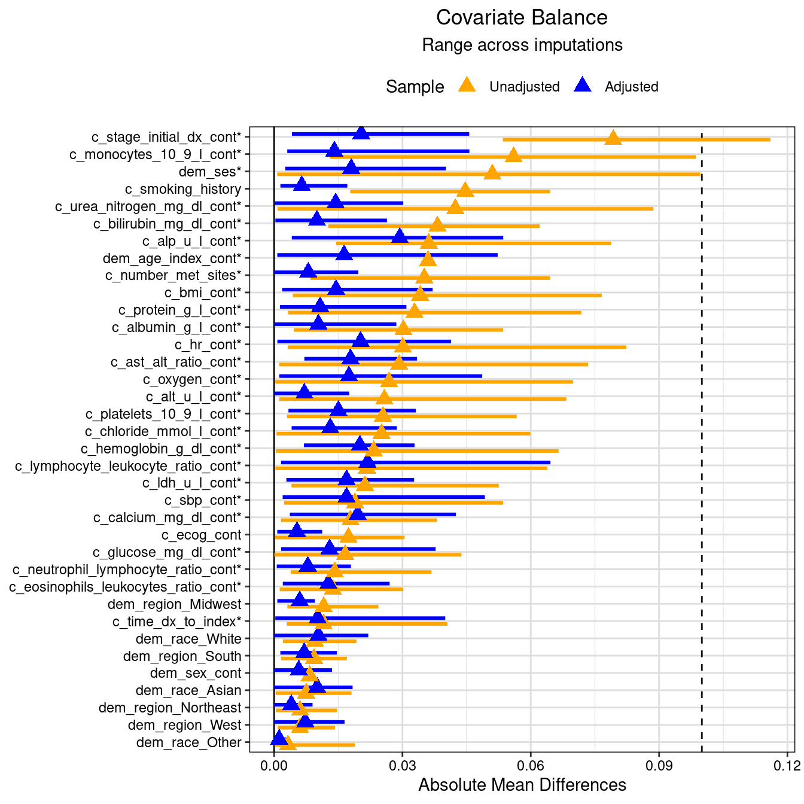
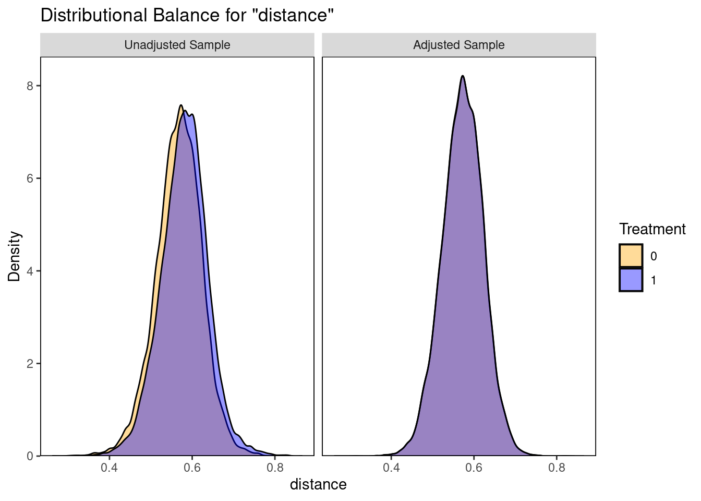

# Application in Cox PH models {#sec-application-in-cox-ph-models}

In @sec-application-in-cox-ph-models we illustrate a reproducible example on how to use `coxph` ([survival](https://cran.r-project.org/web/packages/survival/index.html) package [@survival]) and `svycoxph` ([survey](https://cran.r-project.org/web/packages/survey/index.html) package [@survey]) in combination with multiple imputation by chained equations ([mice](https://cran.r-project.org/web/packages/mice/index.html) package [@mice]) and propensity score matching using the `MatchThem` package [@pishgar2021].

First, we load the required R libraries/packages and some custom functions that are part of the `encore.io` R package that is being developed to streamline the analysis of all **ENCORE** trial emulations (non-public package).


::: {.cell}

```{.r .cell-code}
library(dplyr)
library(survival)
library(mice)
library(MatchThem)
library(survey)
library(here)
library(gtsummary)
library(parallelly)
library(ranger)
library(furrr)
library(cobalt)
library(gsDesign)

source(here("functions", "source_encore.io_functions.R"))

# track time
runtime <- tictoc::tic()
```
:::


## Data generation

We use the `simulate_flaura()` function to simulate a realistic oncology comparative effectiveness analytic cohort dataset with similar distributions to [*FLAURA*](https://www.nejm.org/doi/full/10.1056/NEJMoa1913662), a randomized controlled trial that evaluated the efficacy and safety of osimertinib to standard-of-care (SoC) tyrosine kinase inhibitors (TKIs) in advanced NSCLC patients with a sensitizing EGFR mutation.

The following cohort resembles [distributions observed in the EHR-derived *EDB1*](https://drugepi.gitlab-pages.partners.org/encore/flaura-nct-02296125/00_derive_cohort_edb1.html#table-1-post-eligibility-criteria)dataset used in ENCORE. *Note: the values of some continuous covariates (labs) are displayed after log/log-log transformation.*


::: {.cell}

```{.r .cell-code}
# load example dataset with missing observations
data_miss <- simulate_flaura(
  n_total = 3500, 
  seed = 42, 
  include_id = FALSE, 
  imposeNA = TRUE,
  propNA = .33
  )

# crate Table 1
data_miss |> 
  tbl_summary(
    by = "treat", 
    include = table1_covariates$covariate,
    label = table1_labels
    ) |> 
  add_overall() |> 
  modify_header(
    label ~ "**Patient characteristic**",
    stat_0 ~ "**Total** <br> N = {N}",
    stat_1 ~ "**Comparator** <br> N = {n} <br> ({style_percent(p, digits=1)}%)",
    stat_2 ~ "**Exposure** <br> N = {n} <br> ({style_percent(p, digits=1)}%)"
    ) |> 
  modify_spanning_header(c("stat_1", "stat_2") ~ "**Treatment received**") |> 
  modify_caption("**Table 1. Patient Characteristics**")
```

::: {.cell-output-display}


```{=html}
<div id="mhvesddiol" style="padding-left:0px;padding-right:0px;padding-top:10px;padding-bottom:10px;overflow-x:auto;overflow-y:auto;width:auto;height:auto;">
<style>#mhvesddiol table {
  font-family: system-ui, 'Segoe UI', Roboto, Helvetica, Arial, sans-serif, 'Apple Color Emoji', 'Segoe UI Emoji', 'Segoe UI Symbol', 'Noto Color Emoji';
  -webkit-font-smoothing: antialiased;
  -moz-osx-font-smoothing: grayscale;
}

#mhvesddiol thead, #mhvesddiol tbody, #mhvesddiol tfoot, #mhvesddiol tr, #mhvesddiol td, #mhvesddiol th {
  border-style: none;
}

#mhvesddiol p {
  margin: 0;
  padding: 0;
}

#mhvesddiol .gt_table {
  display: table;
  border-collapse: collapse;
  line-height: normal;
  margin-left: auto;
  margin-right: auto;
  color: #333333;
  font-size: 16px;
  font-weight: normal;
  font-style: normal;
  background-color: #FFFFFF;
  width: auto;
  border-top-style: solid;
  border-top-width: 2px;
  border-top-color: #A8A8A8;
  border-right-style: none;
  border-right-width: 2px;
  border-right-color: #D3D3D3;
  border-bottom-style: solid;
  border-bottom-width: 2px;
  border-bottom-color: #A8A8A8;
  border-left-style: none;
  border-left-width: 2px;
  border-left-color: #D3D3D3;
}

#mhvesddiol .gt_caption {
  padding-top: 4px;
  padding-bottom: 4px;
}

#mhvesddiol .gt_title {
  color: #333333;
  font-size: 125%;
  font-weight: initial;
  padding-top: 4px;
  padding-bottom: 4px;
  padding-left: 5px;
  padding-right: 5px;
  border-bottom-color: #FFFFFF;
  border-bottom-width: 0;
}

#mhvesddiol .gt_subtitle {
  color: #333333;
  font-size: 85%;
  font-weight: initial;
  padding-top: 3px;
  padding-bottom: 5px;
  padding-left: 5px;
  padding-right: 5px;
  border-top-color: #FFFFFF;
  border-top-width: 0;
}

#mhvesddiol .gt_heading {
  background-color: #FFFFFF;
  text-align: center;
  border-bottom-color: #FFFFFF;
  border-left-style: none;
  border-left-width: 1px;
  border-left-color: #D3D3D3;
  border-right-style: none;
  border-right-width: 1px;
  border-right-color: #D3D3D3;
}

#mhvesddiol .gt_bottom_border {
  border-bottom-style: solid;
  border-bottom-width: 2px;
  border-bottom-color: #D3D3D3;
}

#mhvesddiol .gt_col_headings {
  border-top-style: solid;
  border-top-width: 2px;
  border-top-color: #D3D3D3;
  border-bottom-style: solid;
  border-bottom-width: 2px;
  border-bottom-color: #D3D3D3;
  border-left-style: none;
  border-left-width: 1px;
  border-left-color: #D3D3D3;
  border-right-style: none;
  border-right-width: 1px;
  border-right-color: #D3D3D3;
}

#mhvesddiol .gt_col_heading {
  color: #333333;
  background-color: #FFFFFF;
  font-size: 100%;
  font-weight: normal;
  text-transform: inherit;
  border-left-style: none;
  border-left-width: 1px;
  border-left-color: #D3D3D3;
  border-right-style: none;
  border-right-width: 1px;
  border-right-color: #D3D3D3;
  vertical-align: bottom;
  padding-top: 5px;
  padding-bottom: 6px;
  padding-left: 5px;
  padding-right: 5px;
  overflow-x: hidden;
}

#mhvesddiol .gt_column_spanner_outer {
  color: #333333;
  background-color: #FFFFFF;
  font-size: 100%;
  font-weight: normal;
  text-transform: inherit;
  padding-top: 0;
  padding-bottom: 0;
  padding-left: 4px;
  padding-right: 4px;
}

#mhvesddiol .gt_column_spanner_outer:first-child {
  padding-left: 0;
}

#mhvesddiol .gt_column_spanner_outer:last-child {
  padding-right: 0;
}

#mhvesddiol .gt_column_spanner {
  border-bottom-style: solid;
  border-bottom-width: 2px;
  border-bottom-color: #D3D3D3;
  vertical-align: bottom;
  padding-top: 5px;
  padding-bottom: 5px;
  overflow-x: hidden;
  display: inline-block;
  width: 100%;
}

#mhvesddiol .gt_spanner_row {
  border-bottom-style: hidden;
}

#mhvesddiol .gt_group_heading {
  padding-top: 8px;
  padding-bottom: 8px;
  padding-left: 5px;
  padding-right: 5px;
  color: #333333;
  background-color: #FFFFFF;
  font-size: 100%;
  font-weight: initial;
  text-transform: inherit;
  border-top-style: solid;
  border-top-width: 2px;
  border-top-color: #D3D3D3;
  border-bottom-style: solid;
  border-bottom-width: 2px;
  border-bottom-color: #D3D3D3;
  border-left-style: none;
  border-left-width: 1px;
  border-left-color: #D3D3D3;
  border-right-style: none;
  border-right-width: 1px;
  border-right-color: #D3D3D3;
  vertical-align: middle;
  text-align: left;
}

#mhvesddiol .gt_empty_group_heading {
  padding: 0.5px;
  color: #333333;
  background-color: #FFFFFF;
  font-size: 100%;
  font-weight: initial;
  border-top-style: solid;
  border-top-width: 2px;
  border-top-color: #D3D3D3;
  border-bottom-style: solid;
  border-bottom-width: 2px;
  border-bottom-color: #D3D3D3;
  vertical-align: middle;
}

#mhvesddiol .gt_from_md > :first-child {
  margin-top: 0;
}

#mhvesddiol .gt_from_md > :last-child {
  margin-bottom: 0;
}

#mhvesddiol .gt_row {
  padding-top: 8px;
  padding-bottom: 8px;
  padding-left: 5px;
  padding-right: 5px;
  margin: 10px;
  border-top-style: solid;
  border-top-width: 1px;
  border-top-color: #D3D3D3;
  border-left-style: none;
  border-left-width: 1px;
  border-left-color: #D3D3D3;
  border-right-style: none;
  border-right-width: 1px;
  border-right-color: #D3D3D3;
  vertical-align: middle;
  overflow-x: hidden;
}

#mhvesddiol .gt_stub {
  color: #333333;
  background-color: #FFFFFF;
  font-size: 100%;
  font-weight: initial;
  text-transform: inherit;
  border-right-style: solid;
  border-right-width: 2px;
  border-right-color: #D3D3D3;
  padding-left: 5px;
  padding-right: 5px;
}

#mhvesddiol .gt_stub_row_group {
  color: #333333;
  background-color: #FFFFFF;
  font-size: 100%;
  font-weight: initial;
  text-transform: inherit;
  border-right-style: solid;
  border-right-width: 2px;
  border-right-color: #D3D3D3;
  padding-left: 5px;
  padding-right: 5px;
  vertical-align: top;
}

#mhvesddiol .gt_row_group_first td {
  border-top-width: 2px;
}

#mhvesddiol .gt_row_group_first th {
  border-top-width: 2px;
}

#mhvesddiol .gt_summary_row {
  color: #333333;
  background-color: #FFFFFF;
  text-transform: inherit;
  padding-top: 8px;
  padding-bottom: 8px;
  padding-left: 5px;
  padding-right: 5px;
}

#mhvesddiol .gt_first_summary_row {
  border-top-style: solid;
  border-top-color: #D3D3D3;
}

#mhvesddiol .gt_first_summary_row.thick {
  border-top-width: 2px;
}

#mhvesddiol .gt_last_summary_row {
  padding-top: 8px;
  padding-bottom: 8px;
  padding-left: 5px;
  padding-right: 5px;
  border-bottom-style: solid;
  border-bottom-width: 2px;
  border-bottom-color: #D3D3D3;
}

#mhvesddiol .gt_grand_summary_row {
  color: #333333;
  background-color: #FFFFFF;
  text-transform: inherit;
  padding-top: 8px;
  padding-bottom: 8px;
  padding-left: 5px;
  padding-right: 5px;
}

#mhvesddiol .gt_first_grand_summary_row {
  padding-top: 8px;
  padding-bottom: 8px;
  padding-left: 5px;
  padding-right: 5px;
  border-top-style: double;
  border-top-width: 6px;
  border-top-color: #D3D3D3;
}

#mhvesddiol .gt_last_grand_summary_row_top {
  padding-top: 8px;
  padding-bottom: 8px;
  padding-left: 5px;
  padding-right: 5px;
  border-bottom-style: double;
  border-bottom-width: 6px;
  border-bottom-color: #D3D3D3;
}

#mhvesddiol .gt_striped {
  background-color: rgba(128, 128, 128, 0.05);
}

#mhvesddiol .gt_table_body {
  border-top-style: solid;
  border-top-width: 2px;
  border-top-color: #D3D3D3;
  border-bottom-style: solid;
  border-bottom-width: 2px;
  border-bottom-color: #D3D3D3;
}

#mhvesddiol .gt_footnotes {
  color: #333333;
  background-color: #FFFFFF;
  border-bottom-style: none;
  border-bottom-width: 2px;
  border-bottom-color: #D3D3D3;
  border-left-style: none;
  border-left-width: 2px;
  border-left-color: #D3D3D3;
  border-right-style: none;
  border-right-width: 2px;
  border-right-color: #D3D3D3;
}

#mhvesddiol .gt_footnote {
  margin: 0px;
  font-size: 90%;
  padding-top: 4px;
  padding-bottom: 4px;
  padding-left: 5px;
  padding-right: 5px;
}

#mhvesddiol .gt_sourcenotes {
  color: #333333;
  background-color: #FFFFFF;
  border-bottom-style: none;
  border-bottom-width: 2px;
  border-bottom-color: #D3D3D3;
  border-left-style: none;
  border-left-width: 2px;
  border-left-color: #D3D3D3;
  border-right-style: none;
  border-right-width: 2px;
  border-right-color: #D3D3D3;
}

#mhvesddiol .gt_sourcenote {
  font-size: 90%;
  padding-top: 4px;
  padding-bottom: 4px;
  padding-left: 5px;
  padding-right: 5px;
}

#mhvesddiol .gt_left {
  text-align: left;
}

#mhvesddiol .gt_center {
  text-align: center;
}

#mhvesddiol .gt_right {
  text-align: right;
  font-variant-numeric: tabular-nums;
}

#mhvesddiol .gt_font_normal {
  font-weight: normal;
}

#mhvesddiol .gt_font_bold {
  font-weight: bold;
}

#mhvesddiol .gt_font_italic {
  font-style: italic;
}

#mhvesddiol .gt_super {
  font-size: 65%;
}

#mhvesddiol .gt_footnote_marks {
  font-size: 75%;
  vertical-align: 0.4em;
  position: initial;
}

#mhvesddiol .gt_asterisk {
  font-size: 100%;
  vertical-align: 0;
}

#mhvesddiol .gt_indent_1 {
  text-indent: 5px;
}

#mhvesddiol .gt_indent_2 {
  text-indent: 10px;
}

#mhvesddiol .gt_indent_3 {
  text-indent: 15px;
}

#mhvesddiol .gt_indent_4 {
  text-indent: 20px;
}

#mhvesddiol .gt_indent_5 {
  text-indent: 25px;
}

#mhvesddiol .katex-display {
  display: inline-flex !important;
  margin-bottom: 0.75em !important;
}

#mhvesddiol div.Reactable > div.rt-table > div.rt-thead > div.rt-tr.rt-tr-group-header > div.rt-th-group:after {
  height: 0px !important;
}
</style>
<table class="gt_table" data-quarto-disable-processing="false" data-quarto-bootstrap="false">
  <caption><div data-qmd-base64="KipUYWJsZSAxLiBQYXRpZW50IENoYXJhY3RlcmlzdGljcyoq"><div class='gt_from_md'><p><strong>Table 1. Patient Characteristics</strong></p>
</div></div></caption>
  <thead>
    <tr class="gt_col_headings gt_spanner_row">
      <th class="gt_col_heading gt_columns_bottom_border gt_left" rowspan="2" colspan="1" scope="col" id="&lt;div data-qmd-base64=&quot;KipQYXRpZW50IGNoYXJhY3RlcmlzdGljKio=&quot;&gt;&lt;div class='gt_from_md'&gt;&lt;p&gt;&lt;strong&gt;Patient characteristic&lt;/strong&gt;&lt;/p&gt;&#10;&lt;/div&gt;&lt;/div&gt;"><div data-qmd-base64="KipQYXRpZW50IGNoYXJhY3RlcmlzdGljKio="><div class='gt_from_md'><p><strong>Patient characteristic</strong></p>
</div></div></th>
      <th class="gt_col_heading gt_columns_bottom_border gt_center" rowspan="2" colspan="1" scope="col" id="&lt;div data-qmd-base64=&quot;KipUb3RhbCoqIDxicj4gTiA9IDM1MDA=&quot;&gt;&lt;div class='gt_from_md'&gt;&lt;p&gt;&lt;strong&gt;Total&lt;/strong&gt; &lt;br&gt; N = 3500&lt;/p&gt;&#10;&lt;/div&gt;&lt;/div&gt;&lt;span class=&quot;gt_footnote_marks&quot; style=&quot;white-space:nowrap;font-style:italic;font-weight:normal;line-height: 0;&quot;&gt;&lt;sup&gt;1&lt;/sup&gt;&lt;/span&gt;"><div data-qmd-base64="KipUb3RhbCoqIDxicj4gTiA9IDM1MDA="><div class='gt_from_md'><p><strong>Total</strong> <br> N = 3500</p>
</div></div><span class="gt_footnote_marks" style="white-space:nowrap;font-style:italic;font-weight:normal;line-height: 0;"><sup>1</sup></span></th>
      <th class="gt_center gt_columns_top_border gt_column_spanner_outer" rowspan="1" colspan="2" scope="colgroup" id="&lt;div data-qmd-base64=&quot;KipUcmVhdG1lbnQgcmVjZWl2ZWQqKg==&quot;&gt;&lt;div class='gt_from_md'&gt;&lt;p&gt;&lt;strong&gt;Treatment received&lt;/strong&gt;&lt;/p&gt;&#10;&lt;/div&gt;&lt;/div&gt;">
        <span class="gt_column_spanner"><div data-qmd-base64="KipUcmVhdG1lbnQgcmVjZWl2ZWQqKg=="><div class='gt_from_md'><p><strong>Treatment received</strong></p>
</div></div></span>
      </th>
    </tr>
    <tr class="gt_col_headings">
      <th class="gt_col_heading gt_columns_bottom_border gt_center" rowspan="1" colspan="1" scope="col" id="&lt;div data-qmd-base64=&quot;KipDb21wYXJhdG9yKiogPGJyPiBOID0gMTQ4NyA8YnI+ICg0Mi41JSk=&quot;&gt;&lt;div class='gt_from_md'&gt;&lt;p&gt;&lt;strong&gt;Comparator&lt;/strong&gt; &lt;br&gt; N = 1487 &lt;br&gt; (42.5%)&lt;/p&gt;&#10;&lt;/div&gt;&lt;/div&gt;&lt;span class=&quot;gt_footnote_marks&quot; style=&quot;white-space:nowrap;font-style:italic;font-weight:normal;line-height: 0;&quot;&gt;&lt;sup&gt;1&lt;/sup&gt;&lt;/span&gt;"><div data-qmd-base64="KipDb21wYXJhdG9yKiogPGJyPiBOID0gMTQ4NyA8YnI+ICg0Mi41JSk="><div class='gt_from_md'><p><strong>Comparator</strong> <br> N = 1487 <br> (42.5%)</p>
</div></div><span class="gt_footnote_marks" style="white-space:nowrap;font-style:italic;font-weight:normal;line-height: 0;"><sup>1</sup></span></th>
      <th class="gt_col_heading gt_columns_bottom_border gt_center" rowspan="1" colspan="1" scope="col" id="&lt;div data-qmd-base64=&quot;KipFeHBvc3VyZSoqIDxicj4gTiA9IDIwMTMgPGJyPiAoNTcuNSUp&quot;&gt;&lt;div class='gt_from_md'&gt;&lt;p&gt;&lt;strong&gt;Exposure&lt;/strong&gt; &lt;br&gt; N = 2013 &lt;br&gt; (57.5%)&lt;/p&gt;&#10;&lt;/div&gt;&lt;/div&gt;&lt;span class=&quot;gt_footnote_marks&quot; style=&quot;white-space:nowrap;font-style:italic;font-weight:normal;line-height: 0;&quot;&gt;&lt;sup&gt;1&lt;/sup&gt;&lt;/span&gt;"><div data-qmd-base64="KipFeHBvc3VyZSoqIDxicj4gTiA9IDIwMTMgPGJyPiAoNTcuNSUp"><div class='gt_from_md'><p><strong>Exposure</strong> <br> N = 2013 <br> (57.5%)</p>
</div></div><span class="gt_footnote_marks" style="white-space:nowrap;font-style:italic;font-weight:normal;line-height: 0;"><sup>1</sup></span></th>
    </tr>
  </thead>
  <tbody class="gt_table_body">
    <tr><td headers="label" class="gt_row gt_left">Age at index date</td>
<td headers="stat_0" class="gt_row gt_center">69 (64, 74)</td>
<td headers="stat_1" class="gt_row gt_center">69 (64, 74)</td>
<td headers="stat_2" class="gt_row gt_center">69 (64, 74)</td></tr>
    <tr><td headers="label" class="gt_row gt_left">Sex</td>
<td headers="stat_0" class="gt_row gt_center">1,146 (33%)</td>
<td headers="stat_1" class="gt_row gt_center">494 (33%)</td>
<td headers="stat_2" class="gt_row gt_center">652 (32%)</td></tr>
    <tr><td headers="label" class="gt_row gt_left">Race</td>
<td headers="stat_0" class="gt_row gt_center"><br /></td>
<td headers="stat_1" class="gt_row gt_center"><br /></td>
<td headers="stat_2" class="gt_row gt_center"><br /></td></tr>
    <tr><td headers="label" class="gt_row gt_left">    Asian</td>
<td headers="stat_0" class="gt_row gt_center">835 (36%)</td>
<td headers="stat_1" class="gt_row gt_center">347 (35%)</td>
<td headers="stat_2" class="gt_row gt_center">488 (36%)</td></tr>
    <tr><td headers="label" class="gt_row gt_left">    Other</td>
<td headers="stat_0" class="gt_row gt_center">54 (2.3%)</td>
<td headers="stat_1" class="gt_row gt_center">22 (2.2%)</td>
<td headers="stat_2" class="gt_row gt_center">32 (2.4%)</td></tr>
    <tr><td headers="label" class="gt_row gt_left">    White</td>
<td headers="stat_0" class="gt_row gt_center">1,449 (62%)</td>
<td headers="stat_1" class="gt_row gt_center">625 (63%)</td>
<td headers="stat_2" class="gt_row gt_center">824 (61%)</td></tr>
    <tr><td headers="label" class="gt_row gt_left">    Unknown</td>
<td headers="stat_0" class="gt_row gt_center">1,162</td>
<td headers="stat_1" class="gt_row gt_center">493</td>
<td headers="stat_2" class="gt_row gt_center">669</td></tr>
    <tr><td headers="label" class="gt_row gt_left">Smoking history</td>
<td headers="stat_0" class="gt_row gt_center">1,033 (44%)</td>
<td headers="stat_1" class="gt_row gt_center">482 (48%)</td>
<td headers="stat_2" class="gt_row gt_center">551 (41%)</td></tr>
    <tr><td headers="label" class="gt_row gt_left">    Unknown</td>
<td headers="stat_0" class="gt_row gt_center">1,162</td>
<td headers="stat_1" class="gt_row gt_center">493</td>
<td headers="stat_2" class="gt_row gt_center">669</td></tr>
    <tr><td headers="label" class="gt_row gt_left">ECOG</td>
<td headers="stat_0" class="gt_row gt_center">1,327 (57%)</td>
<td headers="stat_1" class="gt_row gt_center">583 (59%)</td>
<td headers="stat_2" class="gt_row gt_center">744 (55%)</td></tr>
    <tr><td headers="label" class="gt_row gt_left">    Unknown</td>
<td headers="stat_0" class="gt_row gt_center">1,162</td>
<td headers="stat_1" class="gt_row gt_center">493</td>
<td headers="stat_2" class="gt_row gt_center">669</td></tr>
    <tr><td headers="label" class="gt_row gt_left">Index year</td>
<td headers="stat_0" class="gt_row gt_center"><br /></td>
<td headers="stat_1" class="gt_row gt_center"><br /></td>
<td headers="stat_2" class="gt_row gt_center"><br /></td></tr>
    <tr><td headers="label" class="gt_row gt_left">    &lt;2018</td>
<td headers="stat_0" class="gt_row gt_center">3,324 (95%)</td>
<td headers="stat_1" class="gt_row gt_center">1,400 (94%)</td>
<td headers="stat_2" class="gt_row gt_center">1,924 (96%)</td></tr>
    <tr><td headers="label" class="gt_row gt_left">    2018+</td>
<td headers="stat_0" class="gt_row gt_center">176 (5.0%)</td>
<td headers="stat_1" class="gt_row gt_center">87 (5.9%)</td>
<td headers="stat_2" class="gt_row gt_center">89 (4.4%)</td></tr>
  </tbody>
  
  <tfoot class="gt_footnotes">
    <tr>
      <td class="gt_footnote" colspan="4"><span class="gt_footnote_marks" style="white-space:nowrap;font-style:italic;font-weight:normal;line-height: 0;"><sup>1</sup></span> <div data-qmd-base64="TWVkaWFuIChRMSwgUTMpOyBuICglKQ=="><div class='gt_from_md'><p>Median (Q1, Q3); n (%)</p>
</div></div></td>
    </tr>
  </tfoot>
</table>
</div>
```


:::
:::


## Step 1 - Multiple imputation

The first step after deriving the analytic cohort includes the creation of multiple imputed datasets using `mice` R package[@mice].

> The `mice` algorithm is one particular instance of a fully conditionally specified model. The algorithm starts with a random draw from the observed data, and imputes the incomplete data in a variable-by-variable fashion. One iteration consists of one cycle through all $Y_j$.

[{fig-align="center"}](https://stefvanbuuren.name/fimd/sec-FCS.html)

The number of iterations $M$ (= number of imputed datasets) in this example is 10, but in ENCORE we follow Stef van Buuren's advice:

> \[...\] if calculation is not prohibitive, we may set $M$ to the average percentage of missing data.
>
> ([Flexible imputation of Missing Data, Sub-chapter 2.8](https://stefvanbuuren.name/fimd/sec-howmany.html))

Following the results of various simulation studies [@shah2014; @Weberpals2024], we use a non-parametric (random forest-based) imputation approach as the actual imputation algorithm.

::: callout-tip
## Advantages of non-parametric imputation approaches

-   Parametric imputation models have to be correctly specified, i.e. also have to explicitly model **nonlinear and non-additive covariate relationships**

-   Many imputation algorithms are not prepared for **mixed type of data**

-   Popular: random forest-based algorithms

    -   for each variable random forest is fit on the observed part and then predicts the missing part

    -   missForest[@stekhoven2012] provides OOB error but **only provides single imputations**

    -   Alternatives: rf, cart in `mice` package [@mice]
:::

*Note: In this example we utilize the `futuremice()` instead of the legacy `mice()` function to run the `mice` imputation across 9 cores in parallel.*


::: {.cell}

```{.r .cell-code}
# impute data
data_imp <- futuremice(
  parallelseed = 42,
  n.core = parallel::detectCores()-1,
  data = data_miss,
  method = "rf",
  m = 10,
  print = FALSE
  )
```
:::


The imputation step creates an object of class...


::: {.cell}

```{.r .cell-code}
class(data_imp)
```

::: {.cell-output .cell-output-stdout}

```
[1] "mids"
```


:::
:::


...which stands for *multiple imputed datasets*. It contains important information on the imputation procedure and the actual imputed datasets.

## Step 2 - Propensity score matching and weighting

Apply propensity score matching and weighting with replacement within in each imputed dataset. As pointed in @sec-simulation-study-results, the **MIte** approach performed best in terms of bias, standardized differences/balancing, coverage rate and variance estimation. In `MatchThem` this approach is referred to a `within` approach (performing matching within each dataset), while the inferior **MIps** approach (estimating propensity scores within each dataset, averaging them across datasets, and performing matching using the averaged propensity scores in each dataset) is referred to as `across` approach. Since **MIte/`within`** has been shown to have superior performance in most cases, we only illustrate this approach here.

Let's assume we fit the following propensity score model within each imputed dataset.


::: {.cell}

```{.r .cell-code}
# apply propensity score matching on mids object
ps_form <- as.formula(paste("treat ~", paste(covariates_for_ps, collapse = " + ")))
ps_form
```

::: {.cell-output .cell-output-stdout}

```
treat ~ dem_age_index_cont + dem_sex_cont + c_smoking_history + 
    c_number_met_sites + c_hemoglobin_g_dl_cont + c_urea_nitrogen_mg_dl_cont + 
    c_platelets_10_9_l_cont + c_calcium_mg_dl_cont + c_glucose_mg_dl_cont + 
    c_lymphocyte_leukocyte_ratio_cont + c_alp_u_l_cont + c_protein_g_l_cont + 
    c_alt_u_l_cont + c_albumin_g_l_cont + c_bilirubin_mg_dl_cont + 
    c_chloride_mmol_l_cont + c_monocytes_10_9_l_cont + c_eosinophils_leukocytes_ratio_cont + 
    c_ldh_u_l_cont + c_hr_cont + c_sbp_cont + c_oxygen_cont + 
    c_ecog_cont + c_neutrophil_lymphocyte_ratio_cont + c_bmi_cont + 
    c_ast_alt_ratio_cont + c_stage_initial_dx_cont + dem_race + 
    dem_region + dem_ses + c_time_dx_to_index
```


:::
:::


::: panel-tabset
### Matching

The matching step happens using the `matchthem()` function, which is a wrapper around the `matchit()` function. This function not only provides the functionality to match on the propensity score, but also to perform (coarsened) exact matching, cardinality matching, genetic matching and more. In this example, we use a simple 1:1 nearest neighbor matching on the propensity score (estimated through logistic regression) without replacement with a caliper of 1% of the standard deviation of the propensity score.


::: {.cell}

```{.r .cell-code}
# matching
mimids_data <- matchthem(
  formula = ps_form,
  datasets = data_imp,
  approach = 'within',
  method = 'nearest',
  distance = "glm",
  link = "logit",
  caliper = 0.01,
  ratio = 1,
  replace = F
  )

# print summary for matched dataset #1
mimids_data
```

::: {.cell-output .cell-output-stdout}

```
A matchit object
 - method: 1:1 nearest neighbor matching without replacement
 - distance: Propensity score [caliper]
             - estimated with logistic regression
 - caliper: <distance> (0.001)
 - number of obs.: 3500 (original), 2672 (matched)
 - target estimand: ATT
 - covariates: dem_age_index_cont, dem_sex_cont, c_smoking_history, c_number_met_sites, c_hemoglobin_g_dl_cont, c_urea_nitrogen_mg_dl_cont, c_platelets_10_9_l_cont, c_calcium_mg_dl_cont, c_glucose_mg_dl_cont, c_lymphocyte_leukocyte_ratio_cont, c_alp_u_l_cont, c_protein_g_l_cont, c_alt_u_l_cont, c_albumin_g_l_cont, c_bilirubin_mg_dl_cont, c_chloride_mmol_l_cont, c_monocytes_10_9_l_cont, c_eosinophils_leukocytes_ratio_cont, c_ldh_u_l_cont, c_hr_cont, c_sbp_cont, c_oxygen_cont, c_ecog_cont, c_neutrophil_lymphocyte_ratio_cont, c_bmi_cont, c_ast_alt_ratio_cont, c_stage_initial_dx_cont, dem_race, dem_region, dem_ses, c_time_dx_to_index
```


:::
:::


The resulting "mimids" object contains the original imputed data and the output of the calls to `matchit()` applied to each imputed dataset.

### Weighting

The weighting step is performed very similarly using the `weightthem()` function. In this example weapply SMR weighting to arrive at the same ATT estimand as matching which is indicated through the `estimand = "ATT"` argument. In case we wanted to weight patients based on overlap weights, `estimand = "AT0"` would need to be specified (which is one of the sensitivity analyses in the FLAURA protocol).

To mitigate the risks of extreme weights, the subsequent `trim()` function truncates large weights by setting all weights higher than that at a given quantile (in this example the 95% quantile) to the weight at the quantile. Since we specify `lower = TRUE`, this is done symmetrically also with the 5% quantile.


::: {.cell}

```{.r .cell-code}
# SMR weighting
wimids_data <- weightthem(
  formula = ps_form,
  datasets = data_imp,
  approach = 'within',
  method = "glm",
  estimand = "ATT"
  )

# trim extreme weights
wimids_data <- trim(
  x = wimids_data, 
  at = .95, 
  lower = TRUE
  )

wimids_data
```

::: {.cell-output .cell-output-stdout}

```
A weightit object
 - method: "glm" (propensity score weighting with GLM)
 - number of obs.: 3500
 - sampling weights: none
 - treatment: 2-category
 - estimand: ATT (focal: 1)
 - covariates: dem_age_index_cont, dem_sex_cont, c_smoking_history, c_number_met_sites, c_hemoglobin_g_dl_cont, c_urea_nitrogen_mg_dl_cont, c_platelets_10_9_l_cont, c_calcium_mg_dl_cont, c_glucose_mg_dl_cont, c_lymphocyte_leukocyte_ratio_cont, c_alp_u_l_cont, c_protein_g_l_cont, c_alt_u_l_cont, c_albumin_g_l_cont, c_bilirubin_mg_dl_cont, c_chloride_mmol_l_cont, c_monocytes_10_9_l_cont, c_eosinophils_leukocytes_ratio_cont, c_ldh_u_l_cont, c_hr_cont, c_sbp_cont, c_oxygen_cont, c_ecog_cont, c_neutrophil_lymphocyte_ratio_cont, c_bmi_cont, c_ast_alt_ratio_cont, c_stage_initial_dx_cont, dem_race, dem_region, dem_ses, c_time_dx_to_index
 - weights trimmed at 5% and 95%
```


:::
:::


The resulting "wimids" object contains the original imputed data and the output of the calls to `weightit()` applied to each imputed dataset.
:::

## Step 3 - Balance assessment

The inspection of balance assessment in multiple imputed and matched/weighted data can be done in a similar way as with a single complete dataset. For illustration we just look at the matched datasets, but the exact same principles also apply to the weighted datasets.

::: panel-tabset
### Balance table


::: {#tbl-balance .cell tbl-cap='Covariate balance table.'}

```{.r .cell-code}
# create balance table
balance_table <- bal.tab(
  x = mimids_data, 
  stats = "m",
  abs = TRUE
  )

balance_table
```

::: {.cell-output .cell-output-stdout}

```
Balance summary across all imputations
                                        Type Mean.Diff.Adj Max.Diff.Adj
distance                            Distance        0.0052       0.0056
dem_age_index_cont                   Contin.        0.0164       0.0431
dem_sex_cont                          Binary        0.0038       0.0095
c_smoking_history                     Binary        0.0071       0.0135
c_number_met_sites                   Contin.        0.0095       0.0243
c_hemoglobin_g_dl_cont               Contin.        0.0080       0.0196
c_urea_nitrogen_mg_dl_cont           Contin.        0.0144       0.0405
c_platelets_10_9_l_cont              Contin.        0.0123       0.0367
c_calcium_mg_dl_cont                 Contin.        0.0146       0.0287
c_glucose_mg_dl_cont                 Contin.        0.0138       0.0304
c_lymphocyte_leukocyte_ratio_cont    Contin.        0.0115       0.0262
c_alp_u_l_cont                       Contin.        0.0143       0.0250
c_protein_g_l_cont                   Contin.        0.0144       0.0259
c_alt_u_l_cont                       Contin.        0.0123       0.0298
c_albumin_g_l_cont                   Contin.        0.0148       0.0418
c_bilirubin_mg_dl_cont               Contin.        0.0213       0.0347
c_chloride_mmol_l_cont               Contin.        0.0147       0.0328
c_monocytes_10_9_l_cont              Contin.        0.0154       0.0284
c_eosinophils_leukocytes_ratio_cont  Contin.        0.0156       0.0216
c_ldh_u_l_cont                       Contin.        0.0139       0.0284
c_hr_cont                            Contin.        0.0124       0.0335
c_sbp_cont                           Contin.        0.0118       0.0263
c_oxygen_cont                        Contin.        0.0143       0.0348
c_ecog_cont                           Binary        0.0054       0.0134
c_neutrophil_lymphocyte_ratio_cont   Contin.        0.0149       0.0270
c_bmi_cont                           Contin.        0.0153       0.0392
c_ast_alt_ratio_cont                 Contin.        0.0179       0.0427
c_stage_initial_dx_cont              Contin.        0.0105       0.0316
dem_race_Asian                        Binary        0.0060       0.0174
dem_race_Other                        Binary        0.0011       0.0030
dem_race_White                        Binary        0.0070       0.0166
dem_region_Midwest                    Binary        0.0040       0.0090
dem_region_Northeast                  Binary        0.0037       0.0118
dem_region_South                      Binary        0.0042       0.0150
dem_region_West                       Binary        0.0049       0.0089
dem_ses                              Contin.        0.0113       0.0370
c_time_dx_to_index                   Contin.        0.0095       0.0245

Average sample sizes across imputations
               0      1
All       1487.  2013. 
Matched   1349.8 1349.8
Unmatched  137.2  663.2
```


:::
:::


### Covariate balance (conditional exchangeability)


::: {.cell}

```{.r .cell-code}
love.plot(
  x = mimids_data,
  abs = TRUE,
  thresholds = 0.1, 
  drop.distance = TRUE,
  var.order = "unadjusted",
  colors = c("orange", "blue"), 
  stars = "std",
  shapes = 17, 
  size = 4, 
  grid = TRUE,
  position = "top"
  )
```

::: {.cell-output-display}
{#fig-balance width=672}
:::
:::


### Distributional balance (positivity)


::: {.cell}

```{.r .cell-code}
bal.plot(
  x = mimids_data,
  var.name = "distance",
  which = "both",
  which.imp = .none,
  colors = c("orange", "blue")
  )
```

::: {.cell-output-display}
{width=672}
:::
:::


### Power calculations

For power calculations, we use the method proposed by Schoenfeld [@schoenfeld1983sample] to compute 1 - type II error rate $\beta$ . For this, we assume the following:

-   $\alpha$ = 0.05 (two-sided)

-   \% exposed (1:1 matching in main analysis) = 50%

-   HR (desired) = 0.8

-   Events = as observed in data

Since we have multiple imputed and matched datasets, we need to average the number of events before before computing $\beta$.


::: {.cell}

```{.r .cell-code}
# make long dataset
data_long <- MatchThem::complete(
  # datasets
  data = mimids_data, 
  # produces a dataset with multiply imputed datasets stacked vertically
  action = "long", 
  # do NOT include observations with a zero estimated weight (non-matched)
  all = FALSE, 
  # do NOT include original dataset with missing values
  include = FALSE
  )

# compute average number of events
# by summing up all events
# and dividing by number of imputed datasets
avg_events <- sum(data_long$death_itt)/mimids_data$object$m

# compute beta
beta_gsDesign <- nEvents(
  alpha = 0.05, 
  sided = 2,
  n = avg_events,
  hr = .8,
  ratio = 1,
  tbl = TRUE
  )

# print results
cat("beta is", beta_gsDesign$beta, "\n")
```

::: {.cell-output .cell-output-stdout}

```
beta is 7.069689e-05 
```


:::

```{.r .cell-code}
cat("power is", (1-beta_gsDesign$beta)*100, "% \n")
```

::: {.cell-output .cell-output-stdout}

```
power is 99.99293 % 
```


:::

```{.r .cell-code}
# gsDesign table
beta_gsDesign
```

::: {.cell-output .cell-output-stdout}

```
   hr      n alpha sided         beta     Power     delta ratio hr0         se
1 0.8 2670.5  0.05     2 7.069689e-05 0.9999293 0.1115718     1   1 0.03870203
```


:::
:::

:::

## Step 4 - Estimation of marginal treatment effects

Next, we compare the marginal treatment effect estimates coming from a Cox proportional hazards model after propensity score matching and weighting as implemented in the `coxph()` and in the `svycoxph()` functions.

From the `MatchThem` documentation:

::: callout-important
-   `with()` applies the supplied model in `expr` to the (matched or weighted) multiply imputed datasets, automatically incorporating the (matching) weights when possible. The argument to `expr` should be of the form `glm(y ~ z, family = quasibinomial)`, for example, excluding the data or weights argument, which are automatically supplied.

-   Functions from the **survey** package, such as `svyglm()`, are treated a bit differently. No `svydesign` object needs to be supplied because `with()` automatically constructs and supplies it with the imputed dataset and estimated weights. When `cluster = TRUE` (or `with()` detects that pairs should be clustered; see the `cluster` argument above), pair membership is supplied to the `ids` argument of `svydesign()`.

-   After weighting using `weightthem()`, `glm_weightit()` should be used as the modeling function to fit generalized linear models. It correctly produces robust standard errors that account for estimation of the weights, if possible. See [`WeightIt::glm_weightit()`](http://127.0.0.1:31281/help/library/WeightIt/help/glm_weightit) for details. Otherwise, `svyglm()` should be used rather than `glm()` in order to correctly compute standard errors.

-   **For Cox models, `coxph()` will produce approximately correct standard errors when used with weighting, but `svycoxph()` will produce more accurate standard errors when matching is used.**
:::

::: panel-tabset
### Matching

We now want to compare treatment effect estimates for `treat` when computed (a) using `coxph` (survival package) and (b) `svycoxph` (survey package). More information on estimating treatment effects after matching is provided in <https://kosukeimai.github.io/MatchIt/articles/estimating-effects.html#survival-outcomes>

#### `coxph`


::: {.cell}

```{.r .cell-code}
# coxph result
coxph_results <- with(
  data = mimids_data,
  expr = coxph(formula = Surv(fu_itt_months, death_itt) ~ treat, 
               weights = weights, 
               cluster = subclass,
               robust = TRUE
               )
  ) |> 
  pool() |> 
  tidy(exponentiate = TRUE, conf.int = TRUE) |> 
  mutate(package = "survival") |> 
  select(package, term, estimate, std.error, conf.low, conf.high) 

coxph_results
```
:::


#### `svycoxph`


::: {.cell}

```{.r .cell-code}
# svycoxph result
svycoxph_results <- with(
  data = mimids_data,
  expr = svycoxph(formula = Surv(fu_itt_months, death_itt) ~ treat),
  cluster = TRUE
  ) |> 
  pool() |> 
  tidy(exponentiate = TRUE, conf.int = TRUE) |> 
  mutate(package = "survey") |> 
  select(package, term, estimate, std.error, conf.low, conf.high)

svycoxph_results
```
:::


#### Summary


::: {.cell}

```{.r .cell-code}
rbind(coxph_results, svycoxph_results)
```

::: {.cell-output .cell-output-stdout}

```
   package  term  estimate  std.error  conf.low conf.high
1 survival treat 0.6980895 0.04378617 0.6402933 0.7611027
2   survey treat 0.6980895 0.04379887 0.6403105 0.7610823
```


:::
:::


### Weighting

#### `coxph`


::: {.cell}

```{.r .cell-code}
# coxph result
coxph_results <- with(
  data = wimids_data,
  expr = coxph(formula = Surv(fu_itt_months, death_itt) ~ treat,
               weights = weights, 
               robust = TRUE
               )
  ) |> 
  pool() |> 
  tidy(exponentiate = TRUE, conf.int = TRUE) |> 
  mutate(package = "survival") |> 
  select(package, term, estimate, std.error, conf.low, conf.high) 

coxph_results
```
:::


#### `svycoxph`


::: {.cell}

```{.r .cell-code}
# svycoxph result
svycoxph_results <- with(
  data = wimids_data,
  expr = svycoxph(formula = Surv(fu_itt_months, death_itt) ~ treat),
  cluster = TRUE
  ) |> 
  pool() |> 
  tidy(exponentiate = TRUE, conf.int = TRUE) |> 
  mutate(package = "survey") |> 
  select(package, term, estimate, std.error, conf.low, conf.high) 

svycoxph_results
```
:::


#### Summary


::: {.cell}

```{.r .cell-code}
rbind(coxph_results, svycoxph_results)
```

::: {.cell-output .cell-output-stdout}

```
   package  term  estimate  std.error  conf.low conf.high
1 survival treat 0.7031986 0.03545543 0.6559682 0.7538297
2   survey treat 0.7031986 0.03546033 0.6559784 0.7538180
```


:::
:::

:::

## Session info


Script runtime: 0.37 minutes.

::: panel-tabset
### Loaded packages


::: {.cell}

```{.r .cell-code}
pander::pander(subset(data.frame(sessioninfo::package_info()), attached==TRUE, c(package, loadedversion)))
```

::: {.cell-output-display}

---------------------------------------------
     &nbsp;        package     loadedversion 
---------------- ------------ ---------------
   **cobalt**       cobalt         4.5.5     

   **dplyr**        dplyr          1.1.4     

   **furrr**        furrr          0.3.1     

   **future**       future        1.34.0     

  **gsDesign**     gsDesign        3.6.4     

 **gtsummary**    gtsummary        2.0.1     

    **here**         here          1.0.1     

 **MatchThem**    MatchThem        1.2.1     

   **Matrix**       Matrix         1.7-0     

    **mice**         mice         3.16.0     

 **parallelly**   parallelly      1.38.0     

   **ranger**       ranger        0.16.0     

   **survey**       survey         4.4-2     

  **survival**     survival        3.5-8     
---------------------------------------------


:::
:::


### Session info


::: {.cell}

```{.r .cell-code}
pander::pander(sessionInfo())
```

::: {.cell-output-display}
**R version 4.4.0 (2024-04-24)**

**Platform:** aarch64-apple-darwin20 

**locale:**
en_US.UTF-8||en_US.UTF-8||en_US.UTF-8||C||en_US.UTF-8||en_US.UTF-8

**attached base packages:** 
_grid_, _stats_, _graphics_, _grDevices_, _datasets_, _utils_, _methods_ and _base_

**other attached packages:** 
_gsDesign(v.3.6.4)_, _cobalt(v.4.5.5)_, _furrr(v.0.3.1)_, _future(v.1.34.0)_, _ranger(v.0.16.0)_, _parallelly(v.1.38.0)_, _gtsummary(v.2.0.1)_, _here(v.1.0.1)_, _survey(v.4.4-2)_, _Matrix(v.1.7-0)_, _MatchThem(v.1.2.1)_, _mice(v.3.16.0)_, _survival(v.3.5-8)_ and _dplyr(v.1.1.4)_

**loaded via a namespace (and not attached):** 
_tidyselect(v.1.2.1)_, _farver(v.2.1.2)_, _fastmap(v.1.2.0)_, _digest(v.0.6.37)_, _rpart(v.4.1.23)_, _lifecycle(v.1.0.4)_, _magrittr(v.2.0.3)_, _compiler(v.4.4.0)_, _rlang(v.1.1.4)_, _sass(v.0.4.9)_, _tools(v.4.4.0)_, _utf8(v.1.2.4)_, _yaml(v.2.3.10)_, _gt(v.0.11.0)_, _knitr(v.1.48)_, _labeling(v.0.4.3)_, _htmlwidgets(v.1.6.4)_, _xml2(v.1.3.6)_, _r2rtf(v.1.1.1)_, _withr(v.3.0.1)_, _purrr(v.1.0.2)_, _nnet(v.7.3-19)_, _fansi(v.1.0.6)_, _jomo(v.2.7-6)_, _xtable(v.1.8-4)_, _colorspace(v.2.1-1)_, _ggplot2(v.3.5.1)_, _globals(v.0.16.3)_, _scales(v.1.3.0)_, _iterators(v.1.0.14)_, _MASS(v.7.3-60.2)_, _cli(v.3.6.3)_, _rmarkdown(v.2.28)_, _crayon(v.1.5.3)_, _generics(v.0.1.3)_, _rstudioapi(v.0.16.0)_, _sessioninfo(v.1.2.2)_, _commonmark(v.1.9.1)_, _minqa(v.1.2.8)_, _DBI(v.1.2.3)_, _pander(v.0.6.5)_, _stringr(v.1.5.1)_, _splines(v.4.4.0)_, _assertthat(v.0.2.1)_, _parallel(v.4.4.0)_, _base64enc(v.0.1-3)_, _mitools(v.2.4)_, _vctrs(v.0.6.5)_, _WeightIt(v.1.3.0)_, _boot(v.1.3-30)_, _glmnet(v.4.1-8)_, _jsonlite(v.1.8.8)_, _mitml(v.0.4-5)_, _listenv(v.0.9.1)_, _locfit(v.1.5-9.10)_, _foreach(v.1.5.2)_, _tidyr(v.1.3.1)_, _glue(v.1.7.0)_, _nloptr(v.2.1.1)_, _pan(v.1.9)_, _chk(v.0.9.2)_, _codetools(v.0.2-20)_, _stringi(v.1.8.4)_, _shape(v.1.4.6.1)_, _gtable(v.0.3.5)_, _lme4(v.1.1-35.5)_, _munsell(v.0.5.1)_, _tibble(v.3.2.1)_, _pillar(v.1.9.0)_, _htmltools(v.0.5.8.1)_, _R6(v.2.5.1)_, _rprojroot(v.2.0.4)_, _evaluate(v.0.24.0)_, _lattice(v.0.22-6)_, _markdown(v.1.13)_, _backports(v.1.5.0)_, _cards(v.0.2.1)_, _tictoc(v.1.2.1)_, _MatchIt(v.4.5.5)_, _broom(v.1.0.6)_, _renv(v.1.0.7)_, _simsurv(v.1.0.0)_, _Rcpp(v.1.0.13)_, _nlme(v.3.1-164)_, _xfun(v.0.47)_ and _pkgconfig(v.2.0.3)_
:::
:::


### Repositories


::: {.cell}

```{.r .cell-code}
pander::pander(options('repos'))
```

::: {.cell-output-display}


  * **repos**:

    ---------------------------------------------
                      REPO_NAME
    ---------------------------------------------
     https://packagemanager.posit.co/cran/latest
    ---------------------------------------------


<!-- end of list -->


:::
:::

:::

## 
